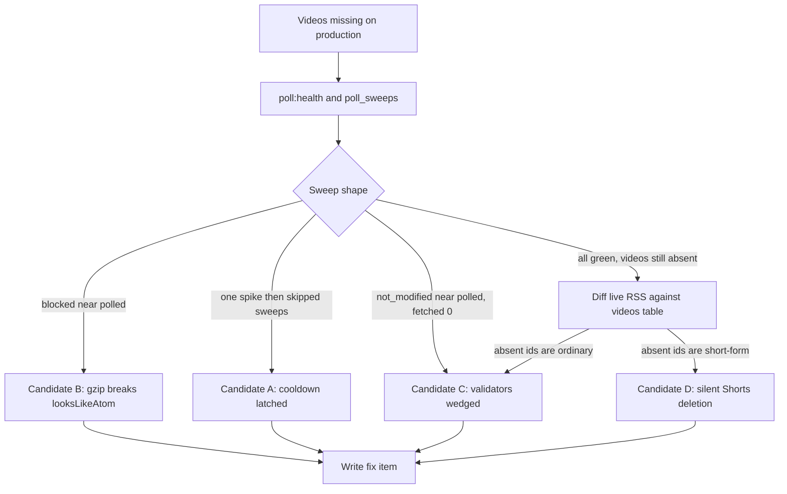
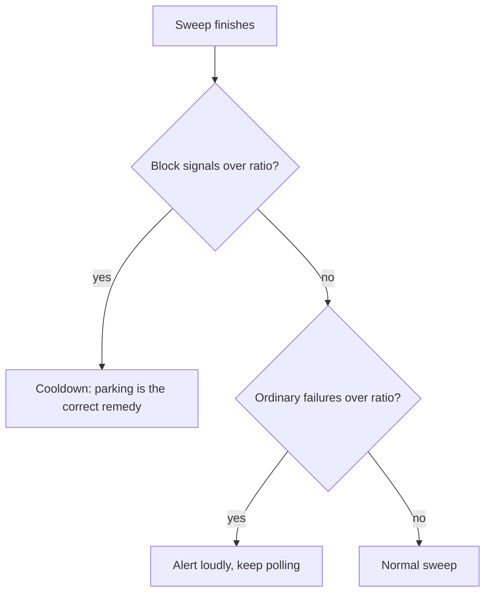

# Roadmap

<!-- Next task number: [037] -->

## [006] Stop feed reverting to skeleton + scroll reset on tab return

**Status:** `todo`
**Depends On:** none

### Goal

Returning to a feed shows the already-loaded cards immediately, keeping scroll position, instead of flashing the loading skeleton and jumping to the top. This covers two triggers: switching to another sidebar feed and back, AND switching to a different **browser tab** and back to the app.

### Scope

- Skip the deferred loading skeleton when cached feed state is already present
- Preserve scroll position across the sidebar navigation round trip
- Ensure returning from another browser tab does not re-trigger the skeleton or reset scroll

### Technical Notes

- `[002]` cached loaded videos in `useFeedCache` and rehydrates them in `Feed.vue:57-62` / `Show.vue`, but the template still wraps the grid in `<Deferred data="videos">` whose `#fallback` (`FeedGridSkeleton`) renders on every navigation because `videos` is an `Inertia::defer` prop that refetches (`Feed.vue:373-376`)
- When cache is present (`hydratedFromCache`), the fallback should not show — render cached `items` directly and let the deferred payload reconcile in the background
- Scroll reset on sidebar nav comes from full Inertia `<Link>` navigations in `NavGroupFeeds.vue` / `NavMain.vue`; consider `preserveScroll` / scroll restoration keyed per feed
- **Browser-tab return**: identify what fires on window focus / `visibilitychange` — an Inertia poll, a `router.reload`, or the deferred prop re-resolving — and make the re-resolution render against the cached view (no skeleton, no scroll jump) rather than replacing `items`. This is a distinct trigger from in-app navigation and must be verified separately
- Applies to both `resources/js/pages/Videos/Feed.vue` and `resources/js/pages/Groups/Show.vue`
- **Build this before `[010]`**: the first-15 auto-load loop must render against cached/hydrated state, not re-trigger this skeleton

### Acceptance Criteria

- [ ] Loading a feed, switching to another, and returning shows cards with no skeleton flash
- [ ] Switching to another browser tab and back to the app shows cards with no skeleton flash and no scroll reset
- [ ] Scroll position on return matches the position before leaving (±a few px)
- [ ] Both `Feed.vue` and `Show.vue` pass both round trips

---

## [007] Open watched video in a background tab (Brave)

**Status:** `todo`
**Depends On:** none

### Goal

Clicking a video card opens the YouTube tab in the background so focus stays on the app instead of switching away. Target browser is Brave (Chromium).

### Scope

- Change card-click open behavior so the new tab opens in the background in Brave/Chromium

### Technical Notes

- Not a simple revert: `onCardClick`'s `window.open(url, '_blank', 'noopener')` (`Feed.vue:168-178`, equivalent in `Show.vue`) has been byte-identical since the first commit, and standard `window.open('_blank')` opens a **foreground** tab in Chromium by design. The only behavioral change on this path was `[001]` moving the click from `@click="onCardClick(video)"` on the card div to a Vue `$emit('card-click')` routed to the parent — but that does not restore backgrounding on its own
- Fix: replace `window.open` with a **synthetic `<a>` element clicked programmatically with a ctrl/meta modifier** (`new MouseEvent('click', { ctrlKey: true, metaKey: true, ... })` on an anchor with `target="_blank"` and `rel="noopener"`), which Chromium/Brave interpret as "open in background tab". Keep the click handler synchronous within the user gesture so no popup blocker trips
- Keep the `setState(..., 'watched')` side effect intact
- Verify in Brave during build (it is a browser heuristic, not a guaranteed API)

### Acceptance Criteria

- [ ] Clicking a card in Brave opens the video in a background tab; the app tab keeps focus
- [ ] The video is still marked watched on click
- [ ] The open action stays within the user gesture (no popup-blocker warning)

---

## [008] Persist show/hide-watched state across feeds

**Status:** `todo`
**Depends On:** none

### Goal

The show-watched / hide-watched toggle keeps its setting when moving between groups and the all-videos feed, instead of resetting per page.

### Scope

- Persist `showWatched` globally on the user (across all group feeds and the all-videos feed)
- Deliver it as a prop and restore it on mount

### Technical Notes

- `showWatched` is component-local `ref(true)` in `Feed.vue:43` and `Show.vue`, so it resets on every navigation
- **Persist server-side**, mirroring the existing `capEnabled` pattern: a column on the user, a POST route like `FeedCapController` (`feed.cap()` in `Feed.vue:155-166`), and the value delivered as a shared prop to the feed pages. Do **not** use `localStorage` — this matches the cap toggle and syncs across devices
- Toggling posts the new value (`preserveScroll`, `preserveState`) and updates local state optimistically; both `Feed.vue` and `Show.vue` read the same prop
- Pairs with `[019]` (starred-only), which uses the identical mechanism — build them together

### Acceptance Criteria

- [ ] Toggling hide-watched, navigating to another feed, and returning keeps hide-watched active
- [ ] The setting survives a full page reload and appears on a second device/browser after login
- [ ] The same persisted value applies to every group feed and the all-videos feed

---

## [009] Unify sidebar button highlighting (Cherry accent border)

**Status:** `todo`
**Depends On:** none

### Goal

Both sidebar sections (main nav and group feeds) use the same active-state highlight: a Cherry red accent border on a transparent background.

### Scope

- Apply one shared **border-only** active-highlight style (Cherry accent border, no fill) to both `NavMain` and `NavGroupFeeds`
- Drop the current solid `bg-cherry` fill on the group-feeds active item

### Technical Notes

- `NavGroupFeeds.vue:39-43` currently uses a solid `bg-cherry` fill for the active item; `NavMain.vue:23-27` relies on the default `SidebarMenuButton` `is-active` styling with no Cherry treatment
- Target: **border-only** — a Cherry accent border with the normal (transparent) background, applied identically to both. Remove the solid fill entirely; when active items lose the white-on-Cherry treatment, revert their text/badge colors to the normal foreground values
- Extract the active class set into one place (a shared const or small wrapper) so both sections stay in sync
- Cherry is available as `border-cherry` / the `--cherry` CSS var

### Acceptance Criteria

- [ ] Active items in both sidebar sections render an identical Cherry accent border with no solid fill
- [ ] Inactive items in both sections share identical styling
- [ ] The active-style definition lives in one place, not duplicated per section

---

## [010] Guarantee first 15 videos without Load more

**Status:** `todo`
**Depends On:** [006]

### Goal

Each feed shows at least 15 videos on first load regardless of how they fall across Today / Yesterday / Earlier this week / Older, without the user clicking Load more.

### Scope

- After mount, auto-load pages until at least 15 cards are visible (or the cursor is exhausted)
- Confirm the time-bucketing keeps showing them even when the recent buckets are empty

### Technical Notes

- Buckets are computed client-side in `Feed.vue:248-279` from whatever `items` were loaded; empty buckets are filtered out, so an "Older" bucket already renders — the real constraint is how many videos are loaded
- **Approach: client-side auto-load loop.** Keep the existing page size but call `loadMore()` (`Feed.vue:184-218`) repeatedly after mount until the count of *visible* cards (after the `showWatched`/starred filters) is ≥15 or `nextUrl` is null. Guard against infinite loops when the cursor is exhausted
- This handles per-channel cap thinning (`[004]/[005]`): with the cap on, a page can yield few visible cards, so the loop keeps pulling
- **Depends on `[006]`**: the loop must render against the cache-aware/hydrated view so it does not re-trigger the loading skeleton or thrash requests. Sequence `[006]` first

### Acceptance Criteria

- [ ] A fresh feed with ≥15 available videos shows ≥15 cards without clicking Load more
- [ ] Videos from Older buckets appear when Today/Yesterday/Week are sparse
- [ ] Holds with the per-channel cap both on and off
- [ ] With fewer than 15 total available, the loop stops at the cursor end without spinning

---

## [011] Fold group management into Subscriptions, remove Groups page

**Status:** `todo`
**Depends On:** none

### Goal

Group create / rename / delete / management lives inside the Subscriptions page, and the standalone Groups index page is removed.

### Scope

- Add a group-management section to `Subscriptions.vue` (create, rename, delete groups)
- Remove `Groups/Index.vue` and its route/nav entry
- Redirect or repoint any links that pointed at the groups index (sidebar "+", "Manage channels" anchors)

### Technical Notes

- Groups index today: `resources/js/pages/Groups/Index.vue` (create/rename via `window.prompt`, delete via `window.confirm`, plus import/export). Group feed view `Groups/Show.vue` stays
- Entry points to update: `NavGroupFeeds.vue:21-27` "+" → point at `/subscriptions#group-management` (deep-link + scroll to the new section); `Subscriptions.vue:396-401` and empty states link to `groupRoutes.index()` → repoint to the in-page section; `Groups/Index.vue:135-139` is removed
- Give the new group-management section an anchor id (e.g. `group-management`) with `scroll-mt` so the deep-link lands cleanly, matching the existing `subscription-group-${id}` anchor pattern
- Import/Export lives in both pages today (`AllGroupsImportExportController`) — keep it available on Subscriptions
- Manual because it is a page-structure/IA change with routing and design decisions; sets up `[016]` and `[017]`

### Acceptance Criteria

- [ ] Groups can be created, renamed, and deleted from the Subscriptions page
- [ ] The standalone Groups index page and its route are gone
- [ ] No dead links remain to the removed page (sidebar "+", manage-channels anchors, empty states)

---

## [012] Replace subscription card Remove text with trash icon

**Status:** `todo`
**Depends On:** none

### Goal

The per-subscription Remove control is a trash-can icon button instead of the word "Remove".

### Scope

- Swap the "Remove" text button for a Heroicons trash icon in both subscription list views

### Technical Notes

- Two identical Remove buttons exist: `Subscriptions.vue:701-708` (alpha view) and `857-864` (by-group view)
- Use `TrashIcon` from `@heroicons/vue/24/outline`; keep `startRemove(channel)` wiring and the confirm dialog
- Preserve accessibility: add `aria-label="Remove subscription"` since the visible text is going away

### Acceptance Criteria

- [ ] Both views show a trash icon button in place of the "Remove" text
- [ ] The button keeps its destructive styling and still opens the confirm dialog
- [ ] The icon button has an accessible label

---

## [013] Always show the channel ID input in Add form

**Status:** `todo`
**Depends On:** none

### Goal

The "Add by channel ID" input is always visible in the Add-to-groups section, not hidden behind a collapsible.

### Scope

- Un-collapse the manual channel ID input so it renders inline at all times

### Technical Notes

- Currently wrapped in `<Collapsible v-model:open="idFallbackOpen">` with a trigger button in `Subscriptions.vue:484-543`
- Remove the collapsible wrapper and the `idFallbackOpen` state; keep the form, hint, validation, and `submitIdForm` logic
- The chevron icons (`ChevronDownIcon`/`ChevronUpIcon`) imports may become unused

### Acceptance Criteria

- [ ] The channel ID input and its Add button are visible without any toggle
- [ ] Adding by ID still works and validates group selection
- [ ] No leftover collapsible trigger or unused state remains

---

## [014] Single/multi group-select toggle in Add form

**Status:** `todo`
**Depends On:** none

### Goal

An icon-button toggle beside "Add to groups" switches between multi-select (current behavior) and single-select, where picking a new group replaces the current one instead of adding to it.

### Scope

- Add an icon-button toggle next to the "Add to groups" label
- In single-select mode, selecting a group replaces the current selection

### Technical Notes

- Selection state is `addGroupIds` (`Subscriptions.vue:64`) toggled by `toggleAddGroup` (`67-76`), which always adds/removes
- Add a `multiSelect` ref; when false, `toggleAddGroup` should set `addGroupIds` to `[groupId]` (or clear if re-clicking the selected one)
- Place the toggle inline with the `<Label>Add to groups</Label>` at `409-410`; pick a pair of Heroicons that read as multi vs single (e.g. squares vs single square)

### Acceptance Criteria

- [ ] A visible toggle sits next to the "Add to groups" label
- [ ] In single mode, clicking a second group switches selection to just that group
- [ ] In multi mode, behavior is unchanged (multiple groups selectable)

---

## [015] Swap TikTok hero icon for a film camera icon

**Status:** `todo`
**Depends On:** none

### Goal

The All Videos feed hero shows a film/video camera icon instead of the TikTok note glyph.

### Scope

- Replace the inline TikTok SVG in the All Videos hero with a Heroicons film/camera icon

### Technical Notes

- The TikTok path is a hand-rolled inline `<svg>` in `Feed.vue:302-312`
- `FilmIcon` and `VideoCameraIcon` are already imported/registered via `lib/groupIcons.ts`; use one from `@heroicons/vue/24/solid` or `/outline` to match the white-on-Cherry hero chip
- Keep the surrounding white rounded chip container and Cherry color

### Acceptance Criteria

- [ ] The All Videos hero shows a film/camera icon, no TikTok glyph
- [ ] Icon sizing/color matches the existing hero chip treatment

---

## [016] Edit group icon from group management

**Status:** `todo`
**Depends On:** [011]

### Goal

A group's icon can be changed from the group-management section, choosing from the full Heroicons set.

### Scope

- Add an icon picker to group management
- Persist the chosen icon and reflect it in the sidebar and group feed hero

### Technical Notes

- `ChannelGroup` already has an `icon` column (`#[Fillable(['user_id', 'name', 'icon'])]`, migration `2026_05_24_214413_add_icon_to_channel_groups_table.php`) and `resolveGroupIcon` maps names to components in `lib/groupIcons.ts`
- **Approach: full `@heroicons/vue/24/outline` set in a searchable grid.** Store the **raw icon name** (e.g. `RocketLaunchIcon`), not the current curated keys
- **Back-compat:** existing groups store legacy curated keys (`Braces`, `Movie`, …). `resolveGroupIcon` must resolve BOTH the full set and the legacy `ICON_REGISTRY` keys (keep the existing map as a fallback), or run a one-time data migration mapping old keys → raw names. Resolve-both is lower risk
- **Bundle:** importing the full icon set is large — lazy-load the picker grid (dynamic import) so it does not bloat the main feed bundle
- Persist via the group update route (`ChannelGroupController`); the picker lives in the group-management section from `[011]`

### Acceptance Criteria

- [ ] Group management offers a searchable icon picker exposing the full Heroicons outline set
- [ ] Selecting an icon persists (as a raw icon name) and updates the sidebar icon and feed hero
- [ ] Groups created before this change (legacy icon keys) still render their icon correctly

---

## [017] Group color: sidebar icon + feed hero background

**Status:** `todo`
**Depends On:** [016]

### Goal

Each group can be assigned a color that drives its sidebar icon color and the feed hero background.

### Scope

- Add a `color` attribute to groups with a color picker in group management
- Apply the color to the sidebar icon and the group feed hero gradient/background

### Technical Notes

- No `color` column exists yet — add a migration and add `color` to `ChannelGroup` fillable (currently `['user_id', 'name', 'icon']`)
- Sidebar icon renders in `NavGroupFeeds.vue:46`; group hero lives in `Groups/Show.vue` (mirrors the Cherry gradient hero in `Feed.vue:288-312`)
- **Approach: curated swatch set (~8–12 presets).** Define a preset table (a shared TS map) where each preset carries its own tuned hero gradient (top/deep stops) and sidebar icon color, all chosen so white hero text stays legible. Store the swatch key or its hex. No free-form picker, so no runtime contrast logic needed
- Default hero stays Cherry when no color is set
- Build the color picker alongside the `[016]` icon picker so icon + color are edited in one place in the group-management section

### Acceptance Criteria

- [ ] A group color can be chosen from the preset swatches and persists
- [ ] The sidebar icon for that group renders in its color
- [ ] The group feed hero background reflects the preset gradient, with legible white text
- [ ] A group with no color set falls back to the Cherry hero

---

## [018] Show publish date on video cards

**Status:** `todo`
**Depends On:** none

### Goal

Each video card shows its publish date floated to the right of the channel row, with the channel name truncating via ellipsis when it is too long.

### Scope

- Add a publish-date element to the card footer, right-aligned opposite the channel info
- Ensure the channel name truncates so the date always has room

### Technical Notes

- Card footer is the channel row in `VideoCard.vue:73-84`; `video.published_at` is already on the `Video` interface (`VideoCard.vue:15`)
- Layout: make the channel name/avatar a flexible truncating group and the date a `shrink-0` element on the right (the channel `<span>` already has `truncate`)
- **Format: compact relative age** — `3d`, `2w`, `5mo` (fall back to a coarse unit for older). Apply via a small helper; both `Feed.vue` and `Show.vue` render through this shared `VideoCard`, so one change covers both

### Acceptance Criteria

- [ ] Cards show the publish date right-aligned in the channel row, in relative format (e.g. `3d`, `2w`)
- [ ] A long channel name truncates with an ellipsis and does not push the date off the card
- [ ] Change appears on both the all-videos and group feeds via `VideoCard`

---

## [019] Starred-only toggle on feeds (persisted)

**Status:** `todo`
**Depends On:** none

### Goal

A "show favorited only" toggle on the feed pages filters cards to favorited channels, and the setting persists across navigation and reloads.

### Scope

- Add a starred-only toggle to the feed hero controls
- Filter the bucketed feed to favorited channels when on
- Persist the setting like `[008]`'s show-watched toggle

### Technical Notes

- `channel_is_favorite` is already on each `Video` (`Feed.vue:24`, used for star display in `VideoCard.vue:53-63`), so filtering is client-side alongside the existing `showWatched` filter in `buckets` (`Feed.vue:253-255`)
- Add the toggle next to the existing hero buttons (`Feed.vue:327-370`) using the star icons already available from `@heroicons/vue`
- **Persist server-side**, identical mechanism to `[008]` (user column + POST route like `FeedCapController`, delivered as a prop). Build alongside `[008]`; apply to both `Feed.vue` and `Show.vue`

### Acceptance Criteria

- [ ] A starred-only toggle appears on the feed hero controls
- [ ] Enabling it shows only cards from favorited channels
- [ ] The setting survives navigation, a full reload, and appears on a second device after login, on both feeds

---

## [020] Keep users logged in for 90 days

**Status:** `todo`
**Depends On:** none

### Goal

Logged-in users stay authenticated for up to 90 days instead of the current default session window.

### Scope

- Extend the effective login duration to 90 days

### Technical Notes

- `config/session.php:35` sets `'lifetime' => (int) env('SESSION_LIFETIME', 120)` (minutes) — 120 min today
- **Approach: long session lifetime.** Set `SESSION_LIFETIME=129600` (90 days). Confirmed low-risk: driver is `database` (`config/session.php:21`), `expire_on_close` is already `false` (`:37`), and GC deletes rows only past `lifetime` — so a 90-day lifetime keeps sessions the full 90 days. Pure config change, no remember-me cookie needed
- Set it in `.env` (and `.env.example`); confirm the default in `config/session.php` if a fallback matters

### Acceptance Criteria

- [ ] A logged-in user remains authenticated after being idle well beyond the old 120-minute window
- [ ] `SESSION_LIFETIME` is set to 129600 in `.env` / `.env.example`
- [ ] Sessions still expire at ~90 days, not indefinitely

---

## [023] Add channels by URL or @handle (YouTube Data API, quota-capped)

**Status:** `todo`
**Depends On:** none

### Goal

Let a user add a channel by pasting a YouTube channel URL or an @handle, not only a raw UC id. Resolution uses the YouTube Data API only where needed, self-capped at 9500 units/day with a soft "daily new-channel cap reached, try again soon" message when exhausted. Supersedes [013] (the smart input replaces the always-visible id-only field). This is the channel-ID acquisition work deferred by [021].

### Scope

- One smart add-input in Subscriptions.vue accepting a UC id, a channel URL, or an @handle
- Backend input sniffing that routes to a free local parse or a counted Data API resolve
- A nullable `handle` column on `channels` to cache handle -> channel_id and dedupe repeat adds for free
- A durable daily API-usage counter (DB row keyed by Pacific date) and a soft cap at 9500
- The cap message on API-requiring adds only; free-path adds still succeed when capped

### Technical Notes

- Accepted forms: raw `UC…` and `/channel/UC…` URLs parse locally (free, no tick); `@handle` and `/@handle` URLs use Data API `forHandle` (1 unit); `/user/legacyname` uses `forUsername` (1 unit). `/c/` custom URLs are rejected with "paste the @handle instead" (no 100-unit search.list, no scraping).
- Counter ticks **per real Data API call**, including calls returning zero results. Route **every** Data API request through one counted client — including the name-enrichment fallback `ChannelResolver::lookupChannelName()` (`ChannelResolver.php:148-165`), so no spend escapes the budget. Prefer the id+snippet that `forHandle`/`forUsername` already returns so name enrichment needs no extra unit.
- `ChannelResolver::fromHandle()` (`ChannelResolver.php:45-84`) already exists but throws if no key; extend it to also handle `/user/` and to persist the resolved `handle`. `fromChannelId()` (`:21-38`) stays the free path; add a URL-sniffing entrypoint that extracts `UC…` from `/channel/…` URLs and dispatches the rest.
- Counter storage: a small table (e.g. `youtube_api_usage` with `date_pt`, `units_used`) with an atomic increment, keyed by `America/Los_Angeles` date to match Google's midnight-Pacific reset. Follow the per-user persistence pattern of `FeedCapController` / `UserChannelCap` (`updateOrCreate` with a sentinel) as the closest existing template, but this counter is **global**, not per-user.
- Cap behavior: check remaining budget **before** an API call. If a resolution would need the API and budget is exhausted, reject with the cap message surfaced as a `value` validation error (matching how `SubscriptionController::store` rethrows resolver failures at `:85-87`). Free-path (`UC…`, `/channel/…`) and cached-handle adds bypass the check.
- Migration: add nullable `handle` (indexed) to `channels` (`2026_05_04_170004_create_channels_table.php` schema; model fillable at `Channel.php:12`). Backfill is unnecessary — handle populates lazily on next resolve.
- Frontend: replace the "Add by channel ID" collapsible (`Subscriptions.vue:484-543`) with one always-visible input; `submitIdForm` (`:163-178`) posts to `subscriptions.store` (`POST /subscriptions`) with a single `value`. Backend derives `mode` from the value shape (drop the client-sent `mode` reliance, or keep `mode` but add an `auto` branch). Keep the group-selection guard.
- **Prerequisite:** a real `YOUTUBE_API_KEY` / `services.youtube.api_key` provisioned against a Google Cloud project with the Data API enabled. `fromHandle()` throws without it.
- **Manual** because it depends on external API-key provisioning and needs empirical verification of `forHandle`/`forUsername` behavior against live channels.

### Acceptance Criteria

- [ ] Pasting a `/channel/UC…` URL or a raw `UC…` id adds the channel with zero Data API units spent and no counter tick
- [ ] Pasting an `@handle`, `/@handle` URL, or `/user/…` URL resolves via the Data API, spends exactly one unit, ticks the counter, and stores the handle
- [ ] Re-adding a previously resolved `@handle` is a free local lookup (no unit, no tick)
- [ ] A `/c/` custom URL is rejected with a message directing the user to the @handle
- [ ] When the counter reaches 9500, an API-requiring add is refused with "daily new-channel cap reached, try again soon", while a `UC…`/`/channel/…` add still succeeds
- [ ] The counter is stored durably and resets at midnight America/Los_Angeles

---

## [030] Remove WebSub entirely

**Status:** `todo`
**Depends On:** [029]

### Goal

WebSub is gone from the codebase. [028] proved YouTube's publisher does not reliably ping its own hub for our feeds: 191 of 193 subscriptions had never delivered, and nothing on our side can fix that. Once [029] makes polling the guaranteed path, every line of WebSub code is vestigial, and vestigial code is a standing invitation to debug a system that was never going to work.

**Must land after [029].** Feed reads are pure DB, and the only scheduled ingestion today is `websub:renew` / `websub:backstop` (`routes/console.php:23-31`). Removing WebSub before the poll sweep exists leaves zero automatic ingestion.

### Scope

- Delete the WebSub controller, services, model, enum, commands, factory, and tests
- Delete the routes, scheduler entries, config block, and env keys
- Drop the `channel_subscriptions` table via a new forward migration
- Remove subscribe-on-add from the subscription flow
- Keep the [028] investigation writeup as the record of why

### Technical Notes

**Reference commit.** `eeee0c4` (`feat: WebSub push ingestion (MVP), archive [021]`) is the first WebSub commit; `c6a1666` is the last commit before it. If push is ever revisited, diff against those rather than resurrecting dead code. Everything worth keeping from the WebSub era, the conditional-GET columns and the pure-DB feed reads, stays.

**Code to delete:**

| Path | Note |
| --- | --- |
| `app/Http/Controllers/WebSubController.php` | Hub verification + delivery callback |
| `app/Services/WebSubSubscriber.php` | |
| `app/Services/WebSubAlerter.php` | Renewal-failure webhook, fired 0 times during the outage |
| `app/Models/ChannelSubscription.php` | |
| `app/Enums/WebSubSubscriptionStatus.php` | |
| `app/Console/Commands/RenewWebSubLeasesCommand.php` | |
| `app/Console/Commands/WebSubBackstopCommand.php` | Redundant once the sweep covers every channel on rotation |
| `app/Console/Commands/SubscribeMissingWebSubCommand.php` | Shipped in [027] |
| `database/factories/ChannelSubscriptionFactory.php` | |
| `tests/Feature/WebSubCallbackTest.php` | |
| `tests/Feature/WebSubRenewalTest.php` | |
| `tests/Feature/WebSubBackstopTest.php` | |
| `tests/Feature/WebSubSubscribeOnAddTest.php` | |
| `tests/Feature/WebSubSubscribeMissingTest.php` | |
| `WEBSUB_LOCAL_SETUP.md` | Local tunnel setup notes |

**Wiring to unpick:** the callback routes in `routes/web.php` and their CSRF exemption in `bootstrap/app.php`; both `Schedule::command('websub:…')` entries in `routes/console.php`; the `websub` block in `config/services.php` (`callback_base`, `alert_webhook`, `backstop_min_silence_hours`, `backstop_min_repoll_hours`, lease and renewal settings) and the matching `.env.example` keys; subscribe-on-add in `SubscriptionController`; WebSub references in `ChannelResolver`, `Channel`, and the "push-driven (WebSub)" comments in the two feed controllers.

**Database.** Add a new forward migration dropping `channel_subscriptions`. Do **not** delete `2026_07_24_000811_create_channel_subscriptions_table.php` or the two later `add_*_to_channel_subscriptions` migrations: rewriting migration history breaks `migrate` against the existing production database. The `channels` conditional-GET migration (`2026_08_23_171925_add_conditional_get_to_channels_table.php`) stays, since [029] depends on it.

**Keep `reference/WEBSUB_DELIVERY_INVESTIGATION.md`.** It is the evidence for the decision, and the reason nobody should try this again without new information from Google.

### Tests

The five `WebSub*Test.php` files are deleted, not rewritten. Verification is that the remaining suite passes and ingestion still works:

- The full Pest suite passes with no WebSub references remaining
- A repo-wide grep for `websub` / `pubsubhubbub` returns only `reference/WEBSUB_DELIVERY_INVESTIGATION.md`, `ROADMAP_DONE.md`, and the `peristalsis/` business docs
- Adding a subscription still succeeds with no subscription side effect
- `channels:poll` from [029] still ingests after the removal

### Acceptance Criteria

- [ ] Every file in the deletion table is gone
- [ ] The WebSub routes, CSRF exemption, scheduler entries, `config/services.php` block, and `.env.example` keys are removed
- [ ] Adding a subscription no longer attempts a hub subscription, and succeeds
- [ ] A new forward migration drops `channel_subscriptions`; the original create and alter migrations are left in place
- [ ] The `channels` conditional-GET columns and the pure-DB feed reads are untouched
- [ ] `reference/WEBSUB_DELIVERY_INVESTIGATION.md` is retained
- [ ] A repo-wide grep for `websub` / `pubsubhubbub` hits only that doc, `ROADMAP_DONE.md`, and `peristalsis/`
- [ ] The full Pest suite passes
- [ ] `channels:poll` still ingests new videos on production after the removal

---

## [031] Scale ingestion past one server IP

**Status:** `freezer`
**Depends On:** [029]

### Goal

Ingestion keeps working when the channel table is large enough that a full 30-minute sweep no longer fits inside the safe request rate of a single server IP. Deferred on purpose: at 193 channels [029]'s poll-everything sweep is correct and this is all complexity for no gain. This item exists so the analysis is not re-derived from scratch when it is needed, and so [029] can stay simple without pretending the ceiling does not exist.

### Scope

- Measuring the actual per-IP request ceiling, which is currently unknown
- Cadence-tiered and demand-ordered channel selection
- The YouTube Data API as a second, IP-independent request budget
- Distributed polling across owned servers
- **Not in scope:** residential proxy rotation. See the reasoning below

### Technical Notes

**Trigger for unfreezing:** a [029] sweep hitting `POLL_MAX_PER_SWEEP`, sustained block signals from the [029] detector, or a deliberate decision to take the app multi-tenant. Not before.

**The central unknown.** `reference/YOUTUBE_RSS_RATE_LIMITS.md` establishes that no per-IP RSS ceiling is published, and that the `~1,500-2,000 channels` figure inherited into [021] is unsourced and probably misattributed from a FreeTube post describing a different endpoint under an explicit RSS exemption. Every scaling decision below multiplies a number nobody has measured. **Measure it first:** ramp the [029] sweep's request rate stepwise on production and watch the [029] block detector. That converts the central unknown into a number, and it is cheap. Everything else here is guesswork until it is done.

**Why a fixed budget beats a staleness threshold at scale.** Poll-everything makes the outbound request rate grow linearly with channel count. A fixed hourly budget with rotation makes it a constant you set, and freshness degrades gracefully instead of the request rate exploding. At a 200/hour budget:

| Channels | Refresh interval | Requests/day |
| --- | --- | --- |
| 193 | ~1 hour | ~4,600 |
| 1,000 | ~5 hours | ~4,600 |
| 10,000 | ~2 days | ~4,600 |
| 50,000 | ~10 days | ~4,600 |

The 50,000 row is why a flat budget alone is not the answer either: RSS returns only the ~15 most recent videos per channel, so a 10-day interval starts losing uploads outright on active channels, not merely delaying them.

**Cadence tiering is the largest single lever, and it costs no infrastructure.** Flat rotation gives a dormant channel the same slot as a daily uploader. Derive an expected upload interval per channel from its own video history and poll proportional to it. A rough 50,000-channel model:

| Tier | Share | Poll every | Requests/day |
| --- | --- | --- | --- |
| Hot, 2+ uploads/week | 10% (5,000) | 2 hours | 60,000 |
| Warm, weekly | 25% (12,500) | 12 hours | 25,000 |
| Cold, monthly | 40% (20,000) | 3 days | 6,700 |
| Dormant, 6 months silent | 25% (12,500) | 7 days | 1,800 |
| **Total** | 50,000 | | **~93,500/day** |

Roughly 13x cheaper than flat 30-minute polling of the same table, while leaving hot channels far fresher than any flat rotation would.

**Demand ordering, not demand-driven fetching.** Polling a channel only when a user loads a feed containing it scales request volume with active attention rather than catalog size, which is a genuinely better scaling property. Fetching *during* the request is not: a feed with 200 stale channels blocks first paint for tens of seconds, which is why [021] removed exactly that behaviour and [022] made feed reads pure DB. Demand is also bursty in the worst possible shape, since a morning login spike is precisely the burst pattern that draws an IP block, whereas a budget smooths by construction.

The synthesis is to keep the budget as the rate governor and let demand drive **priority**: a feed load records want on the channel rows (a cheap non-blocking write, gated by the fetch TTL so repeat loads do not pile up), and the sweep selects `ORDER BY demand DESC, last_fetched_at ASC`. Feed reads stay pure DB, the queue absorbs the spike so the cost of a burst is latency rather than a block, and an empty demand queue means a sweep that costs nothing. A **floor** stays underneath it, polling every channel at least once every N days regardless of demand, so an unviewed channel does not accumulate permanent gaps against the ~15-item RSS cap.

**The Data API is a separate budget, and cheaper than [023] assumes.** `playlistItems.list` against a channel's uploads playlist costs **1 unit** and returns up to 50 videos (confirmed against Google's quota-cost documentation, 2026-08-24). The free 10,000 units/day is therefore ~10,000 channel checks/day, and granted quota increases are commonly 50,000-100,000. Two properties matter more than the volume: the quota is **per project, not per IP**, so it is an entirely independent ceiling with no block risk; and a unit quota tolerates bursts that an IP ceiling does not, which makes it the natural home for demand spikes while RSS carries the floor. The 50,000-channel tiered model above, ~93,500 checks/day, fits inside a single granted quota increase with no proxies and no server fleet.

The audit is the constraint, not the quota: reported waits run from weeks to several months, and denials cluster on vague use cases, missing privacy policies, and anything resembling bulk download. Apply well before the capacity is needed.

**Distributed polling is legitimate but is a later rung.** N owned servers each polling a disjoint channel slice gives N times the per-IP limit and is ordinary horizontal scaling, spreading real load rather than concealing it. Three caveats: it multiplies a ceiling nobody has measured; N droplets from one provider are N addresses in ranges that already score worse than residential and are trivially correlated by ASN, so spread across providers and regions or the gain is well under N; and it carries real operational weight in slice assignment, result shipping, per-node health, and partial-failure semantics.

**Residential proxy rotation is out.** It is evasion rather than architecture, defeating an anti-abuse decision deliberately applied to us by making traffic appear to come from unrelated home users. It is also a bad engineering bet: an arms race against Google's anti-abuse team that breaks without warning, poisons any future relationship with YouTube, and rests on a supply chain that is independently ethically compromised.

**Escalation ladder, in order:**

1. Measure the real per-IP ceiling
2. Cadence tiering plus demand ordering, with a floor underneath
3. Data API `playlistItems.list` for the hot tier, RSS for the cold tier
4. Data API quota increase application, applied for early
5. Distributed polling across owned servers, mixed providers and regions

**Related:** `reference/YOUTUBE_RSS_RATE_LIMITS.md` sections 5, 7, and 8 are the evidence base for all of the above. Section 6 records a platform-wide `videos.xml` outage over 13-17 February 2026, which is the standing argument for holding a second ingestion path that does not touch that endpoint, and which [030] should weigh before deleting WebSub outright.

### Acceptance Criteria

- [ ] The per-IP request ceiling is measured on production and recorded as a number, replacing the unsourced `~1,500-2,000` figure
- [ ] Channel selection is tiered by observed upload cadence rather than treating every channel alike
- [ ] Feed loads raise a channel's poll priority without blocking the request, and feed reads stay pure DB
- [ ] A floor guarantees every channel is polled at least once every N days regardless of demand
- [ ] Outbound request rate stays bounded by a value we set, whatever the channel count or demand spike
- [ ] The 15-item RSS cap never silently drops an upload at the configured tier intervals

---

## [032] Diagnose missing videos since the [029] polling deploy

**Status:** `next`
**Mode:** `Manual`
**Depends On:** [029]

### Goal

Find out why uploads are still going missing on production now that scheduled polling is the ingestion backbone, and separate the new-since-[029] causes from the pre-existing one the user suspects predates the WebSub work. As with [028], the output is a proven cause plus a specified fix item, not a ranked suspicion.

### Scope

- Read the production sweep record and decide, from data, which of the candidate mechanisms is actually firing
- Cover both the post-[029] regression candidates and the pre-existing silent-deletion candidate
- Confirm which specific videos are missing, by comparing a channel's live RSS against what the database holds
- Record the cause and hand the build to a follow-up item
- Ship the diagnosis tooling itself as `poll:diagnose`, because production readings have to be repeatable by whoever runs the fix items
- **Not in scope:** implementing any fix. Each confirmed cause becomes its own item

### Technical Notes

**Context.** [028] proved YouTube's publisher does not reliably ping its own hub, and [029] made a 30-minute `channels:poll` sweep the sole automatic ingestion path. The user reports, on the post-[029] production deploy: a few new videos arrived, but videos were apparently missing this morning. Nothing about the UI visibly broke. The user also suspects a longer-standing bug, because the original [021] WebSub deploy surfaced a batch of videos that had been missing before push existed at all.

That last observation matters. A backlog appearing the moment a *new* ingestion path opened means videos were absent from the database while the old path reported healthy. That is the signature of a silent drop, not of a fetch failure.

**Candidate A. The cooldown latched and parked ingestion.** `PollChannelsCommand::shouldCooldown` trips when `(failed + blocked) / attempted >= POLL_BLOCK_FAILURE_RATIO` (0.5) on a sweep of at least `POLL_BLOCK_MIN_SAMPLE` (5). `PollCooldown::start` then parks every automatic fetch for `POLL_COOLDOWN_HOURS` (6). `POLL_ALERT_WEBHOOK` is unset by default, so the only outward sign is one `Log::error` line. A single bad sweep overnight is a six-hour ingestion blackout that looks exactly like "missing this morning". [029] accepted this risk explicitly. The question is whether it fired.

**Candidate B. `blockSignal` false-positives on every response.** `RssFetcher::pollHeaders` sets `Accept-Encoding: gzip, deflate` by hand. Guzzle decodes transparently only when it owns that header, so a manually set value can leave the body compressed. `looksLikeAtom()` then fails its `<feed` match on all 193 channels, every 200 is classified `non_atom_200`, the ratio is 1.0, and the cooldown trips on the first sweep and re-trips every six hours indefinitely. This is new in [029] and would produce both reported symptoms at once. Cheap to falsify: `blocked` would sit at or near `channels_polled` on every row of `poll_sweeps`.

**Candidate C. Conditional-GET validators wedged on a stale response.** Also new in [029]. `rss_etag` and `rss_last_modified` are stored after a successful ingest and replayed as `If-None-Match` / `If-Modified-Since`. A 304 touches `last_fetched_at` and ingests nothing. If YouTube's edge answers 304 against a validator captured from a stale edge node, that channel is frozen at the videos it held when the validator was stored, and every health signal reads perfect: zero failures, zero blocks, zero staleness. `force: true` does not help, because force bypasses the TTL, not the validators, so `GroupFeedController::refresh` cannot break out of it either. This candidate best matches "missing videos with nothing visibly wrong", and it is the one [028]'s evidence gotchas would have missed again.

**Candidate D. Silent Shorts deletion, pre-existing.** `RssFetcher::ingest()` hard-deletes the `videos` row and its `user_video_states` rows for any entry whose Atom `alternate` href is under `/shorts/`, with no log line and no counter. `videos:prune-shorts` does the same across the whole table using the watch-page canonical URL from `YoutubeShortsDetector`. YouTube canonicalises short-form and vertical uploads under `/shorts/` liberally, so ordinary uploads can be classified as Shorts and destroyed, taking the user's watched state with them. This predates WebSub entirely and is the strongest explanation for the "this was broken before" instinct. It is also self-concealing: the video reappears on a later sweep if the href changes, then vanishes again.

**Candidate E. Timeouts tuned for a page request, not a sweep.** `RssFetcher`'s 2.0s connect and 3.0s total defaults date from when fetching happened inside an Inertia deferred prop. A sweep has no such constraint, and every timeout counts as `failed`, feeding Candidate A's ratio.

**Discriminating between them.** Cheap, mostly one reading each, run on production:

| Reading | How | Tells you |
| --- | --- | --- |
| Cooldown state and staleness | `php artisan poll:health` | Candidate A directly, and rules Candidate C in if everything reads green while videos are missing |
| Sweep history | `select started_at, channels_polled, fetched, not_modified, failed, blocked, cooldown_triggered from poll_sweeps order by started_at desc limit 48;` | A vs B vs C. `blocked` near `channels_polled` is B. `not_modified` near `channels_polled` with `fetched` at 0 across a full day is C. One spike then skipped sweeps is A |
| Cooldown log lines | `/bin/grep 'Polling cooldown started' storage/logs/laravel.log` | When A fired, and the reason recorded |
| Validator bypass | Null `rss_etag` and `rss_last_modified` for one known-missing channel, then `php artisan channels:poll --limit=1 --ignore-cooldown` | Confirms C if the missing videos land immediately |
| Ground truth per channel | Fetch that channel's RSS by hand and diff the 15 `yt:videoId` values against `videos` | Names exactly which uploads are absent, and whether they are short-form |
| Deletion churn | Look for a known-missing video id in `user_video_states` | D leaves no row behind, so a video the user had marked watched returning unwatched is a tell |

The [028] evidence gotchas still apply: an empty `laravel.log` proves nothing, `grep -c` with zero matches exits non-zero and silently breaks an `&&` chain, and `/bin/grep` is the working path on the Forge box.

**Production readings, 2026-08-25 (~13:00-19:00 UTC).** `poll:health` plus the last 48 `poll_sweeps` rows:

```
Cooldown: ACTIVE until 2026-08-25T19:00:29+00:00 (178 of 193 requests failed (0 of them block signals)).
Staleness: 193 channels, max 1464 min, median 1463 min, never fetched 0.
Last 24h: 3 sweeps, 579 polls, 560 fetch failures, 0 block signals, 0 cap hits, 3 cooldowns.
All rss_url values are canonical.
2026-08-25 13:00:04 polled=193 fetched=15 notmod=0 failed=178 blocked=0 cooldown=1
2026-08-25 06:30:03 polled=193 fetched=3  notmod=0 failed=190 blocked=0 cooldown=1
2026-08-25 00:00:13 polled=193 fetched=1  notmod=0 failed=192 blocked=0 cooldown=1
```

| Candidate | Reading | Verdict |
| --- | --- | --- |
| B, gzip breaks `looksLikeAtom` | `blocked = 0` on every sweep | **Eliminated** |
| C, validators wedged | `not_modified = 0` on every sweep, so no 304 has ever been served | **Eliminated** |
| A, cooldown latched | 3 cooldowns across 3 sweeps | **Real, but a symptom** |
| E, timeouts | 560 of 579 polls failed with 0 block signals | **Leading root cause** |

The failures are not 403, 429, or a non-Atom 200, and they are not 304. `RssFetcher` logs them with `'status' => 'no_response'`, meaning no `Response` object came back at all: a connect or read timeout, or a transport-level error, against the 2.0s connect / 3.0s total defaults.

Two things this changes about the item:

- **A is downstream of E, not a separate cause.** Every sweep trips the ratio, so polling runs 3 times a day instead of 48. The [029] note that a cooldown on non-block failures is "the safe direction" is falsified in practice: it converts a partial fetch problem into near-total ingestion loss. The cooldown should distinguish block signals from ordinary failures.
- **The `no_response` log carries no exception message**, so the failure mode cannot be read back from `laravel.log`. That is the gap to close first, alongside the timing question of whether generous timeouts succeed where 2.0/3.0 fail. If both tight and generous timeouts fail, the cause is egress-level (DNS, TLS, or an IP-level refusal that never reaches HTTP) which is exactly why block detection reads zero.

**Candidate D is untouched by these readings.** It deletes rows after a *successful* fetch, so it is orthogonal to the failure storm and still needs its own check.

**Divergence from plan, 2026-08-25.** Two things changed while executing this item.

*The diagnosis tooling shipped as code.* `poll:diagnose` (`app/Console/Commands/DiagnosePollingCommand.php`) replaces the throwaway tinker script the plan assumed. `php artisan tinker <file>` drops into an interactive shell after including the file, which is useless over a non-interactive ssh, and the readings this item needs are the same readings every fix item ([033] through [036]) will need to verify itself. Five sections: sweep history, single-fetch timing tight against generous with the exception class captured, pool timing in the sweep's real concurrent shape, a live-RSS-against-`videos` diff naming every absent upload, and the deletion tells. Read-only, covered by `tests/Feature/DiagnosePollingCommandTest.php`. So "this item builds nothing" is no longer true: it builds the instrument, not the fix.

*Candidate D is eliminated on local evidence, pending a production confirmation.* Ten `/shorts/`-href entries checked against their watch pages agree with YouTube's own canonical in ten of ten, all 61 seconds or under, nine of ten portrait. A scan of 236 live `/shorts/` entries found zero currently stored in `videos`, so nothing is queued for silent deletion. The design objection survives as [036]: the rule deletes rather than flags, takes `user_video_states` with it, and leaves no trace, so a future misfire would be invisible.

**Remaining work.** The three unchecked criteria all need `poll:diagnose` run on production, which needs this commit deployed first:

```bash
cd /home/forge/peristalsis.on-forge.com/current
php8.4 artisan poll:diagnose --shorts-probe=10 2>&1 | tee /tmp/poll-diagnose.out
```



### Acceptance Criteria

- [x] The production sweep record is read, and Candidates A, B, C, and E are each confirmed or eliminated from `poll_sweeps` data rather than from reasoning
- [x] It is established whether a cooldown has fired since the [029] deploy, when, and for what recorded reason
- [ ] At least one specific missing video is identified by id, with its channel, publish time, and whether YouTube canonicalises it under `/shorts/`
- [ ] A live RSS fetch for that channel is diffed against the `videos` table, proving whether the entry was never ingested or was ingested and later deleted
- [ ] Candidate D is confirmed or eliminated by checking whether missing ids are short-form and whether their `user_video_states` rows are gone
- [x] Separate verdicts are recorded for the post-[029] regression and for the pre-existing loss observed at the [021] deploy, since they may be different causes
- [x] Findings are written to `reference/POLLING_LOSS_INVESTIGATION.md` with the reproduction commands and the readings they returned
- [x] Each confirmed cause is specified as a follow-up roadmap item, [033] through [036]

### Verification (no automated tests)

This is a diagnosis, so there is nothing to assert. Every criterion is verified by direct observation against production, with the commands recorded in the reference document. [028] is the precedent: a suite mocking the RSS endpoint stayed green through a twenty-hour outage, because every in-process signal read healthy. Candidate C has that same property, which is why it needs a production reading rather than a test.


---

## [033] Record the transport failure behind a failed poll

**Status:** `next`
**Mode:** `Auto`
**Depends On:** [032]

### Goal

Make a failed RSS poll say what actually went wrong. Today `RssFetcher` logs the literal string `no_response` for every `Response`-less outcome, so DNS failure, TLS handshake failure, connect timeout, and read timeout are indistinguishable after the fact. On production this blind spot turned 560 failures in 24 hours into an unreadable log, and forced [032] to build a bespoke command to learn anything at all.

### Scope

- Catch the transport exception in `RssFetcher::fetchForChannels` and log its class and message alongside the channel
- Classify the outcome coarsely enough to count: connect timeout, read timeout, DNS, TLS, other
- Surface the classification in `poll:health` and in the sweep record, so the shape of a failure storm is readable without a log dive
- **Not in scope:** changing any timeout value. That is [034]

### Technical Notes

`Http::pool` returns the `Throwable` in the response slot rather than throwing, which is why `$resp instanceof Response` is false and the current code falls through to `'status' => 'no_response'` at `app/Services/RssFetcher.php:104-111`. The exception is already in hand and is simply discarded. Guzzle raises `ConnectException` for connect-phase failures, DNS and TLS included and distinguishable by the cURL errno in the message, and `RequestException` for a read timeout.

This is the cheapest item of the four and every other one is easier to verify once it lands, so build it first.

### Acceptance Criteria

- [ ] A poll that fails without a response logs the exception class and message, not the bare string `no_response`
- [ ] Failures are counted by coarse category, and the category counts survive into the sweep record
- [ ] `poll:health` reports the dominant failure category over its window
- [ ] Nothing about the success path or the block-signal path changes

### Tests

- [ ] `tests/Feature/RssFetcherTest.php` - a connect exception is logged with its class and message
- [ ] `tests/Feature/RssFetcherTest.php` - a read timeout and a connect timeout land in different categories
- [ ] `tests/Feature/PollHealthCommandTest.php` - the health report names the dominant failure category

---

## [034] Timeouts sized for a sweep, not for a page request

**Status:** `next`
**Mode:** `Auto`
**Depends On:** [032], [033]

### Goal

Give the polling sweep a request budget that matches what it is: a background job with no user waiting on it. The current 2.0s connect / 3.0s total defaults are hardcoded in the `RssFetcher` constructor and date from when fetching happened inside an Inertia deferred prop. On production they fail 560 of 579 polls, which is the root cause of the post-[029] loss and, one layer earlier, of the pre-[021] loss too.

### Scope

- Make connect and total timeouts configurable rather than hardcoded constructor defaults
- Give the sweep a generous budget and leave any request-path fetch on a tight one, since those have a user waiting
- Confirm on production, with `poll:diagnose`, that the new budget actually succeeds where the old one fails
- **Not in scope:** retry logic, or changing the pool chunk size, unless the production reading shows concurrency is the constraint

### Technical Notes

`AppServiceProvider` binds `RssFetcher` as a singleton and passes no timeout arguments at all (`app/Providers/AppServiceProvider.php:19-22`), so the constructor defaults are the only values that have ever run. `config/services.php` has a `polling.*` block with no timeout knob.

**Do not skip the measurement.** [032] proved the failures are `Response`-less and that the same requests succeed from a residential IP in about 500ms, but it did not establish that a generous budget succeeds *from the production box*. If both tight and generous fail there, the cause is egress-level, meaning DNS, TLS, or an IP-level refusal that never reaches HTTP, and a larger timeout fixes nothing. `poll:diagnose` reports both budgets side by side for exactly this reason, and [033] makes the failure itself readable.

### Acceptance Criteria

- [ ] Connect and total timeouts come from config, with the sweep and the request path able to differ
- [ ] `poll:diagnose` run on production shows the sweep's new budget succeeding where 2.0/3.0 fails
- [ ] A sweep on production completes with a failure count in line with the generous reading, not the tight one
- [ ] If generous timeouts also fail on production, that is recorded in `reference/POLLING_LOSS_INVESTIGATION.md` and this item is re-scoped rather than closed

### Tests

- [ ] `tests/Feature/RssFetcherTest.php` - configured timeouts reach the outbound request
- [ ] `tests/Feature/ChannelsPollCommandTest.php` - the sweep uses the sweep budget, not the request-path budget

---

## [035] Cool down on block signals, not on ordinary failures

**Status:** `next`
**Mode:** `Auto`
**Depends On:** [032], [033]

### Goal

Stop a transport problem from parking ingestion for six hours at a time. `PollChannelsCommand::shouldCooldown` counts `failed + blocked` against its ratio, so a mechanism built for IP blocks fires on timeouts. On production this turned a partial fetch failure into 3 sweeps a day where the schedule asks for 48, which is the difference between degraded ingestion and near-total loss.

### Scope

- Trip the cooldown on block signals, not on the combined bad-response count
- Keep a separate, louder response to a sweep that fails wholesale for non-block reasons: it is a real emergency, it just is not a block, and parking for six hours is the wrong remedy
- Make the cooldown visible without a log dive, since `POLL_ALERT_WEBHOOK` is unset by default and one `Log::error` line is the only outward sign today
- **Not in scope:** the timeout values themselves ([034])

### Technical Notes

[029] recorded cooling down on non-block failures as "the safe direction", on the reasoning that a failure storm might be a block the detector missed. Production falsified that: the failure mode it actually caught was not a block, and the remedy made the symptom far worse than the disease. `blockSignal` already distinguishes the two cleanly, on 403, 429, and a non-Atom 200, and [032] confirmed it reads zero through a 97%-failure sweep.

The asymmetry worth preserving: a block is all-or-nothing and polling through it may extend it, so backing off is correct. A timeout storm is the opposite, where backing off guarantees loss and fixes nothing.



### Acceptance Criteria

- [ ] The cooldown trips on block signals alone
- [ ] A sweep that fails wholesale for non-block reasons keeps polling and raises a distinct, loud signal
- [ ] The two conditions are distinguishable in `poll_sweeps` and in `poll:health` after the fact
- [ ] A cooldown, once tripped, is still visible without reading `laravel.log`

### Tests

- [ ] `tests/Feature/ChannelsPollCommandTest.php` - a sweep of transport failures does not trip the cooldown
- [ ] `tests/Feature/ChannelsPollCommandTest.php` - a sweep of block signals still does
- [ ] `tests/Feature/ChannelsPollCommandTest.php` - a wholesale non-block failure raises the distinct signal
- [ ] `tests/Feature/PollHealthCommandTest.php` - the two conditions read differently in the health report

---

## [036] Flag Shorts instead of destroying them

**Status:** `next`
**Mode:** `Auto`
**Depends On:** [032]

### Goal

Make Shorts filtering reversible and observable. `RssFetcher::ingest` currently hard-deletes the `videos` row and every attached `user_video_states` row for any entry whose Atom `alternate` href is under `/shorts/`, with no log line and no counter. [032] found no false positive in a ten-video sample and no stored row queued for deletion, so this is hardening rather than a bug fix, but a rule that destroys user data silently has no way to tell anyone when it is wrong.

### Scope

- Mark a video as short-form rather than deleting it, and filter it out of the feed at read time
- Keep `user_video_states` intact, so a misclassification never costs the user their watched state
- Count and log what the rule classifies, so a spike is visible
- Reconcile `videos:prune-shorts` with the new model, since it does the same deletion across the whole table using the watch-page canonical
- **Not in scope:** a user-facing setting for showing Shorts. Worth having, but a separate item

### Technical Notes

The deletion sits at `app/Services/RssFetcher.php:275-280`. `PruneShortVideosCommand` performs the equivalent via `YoutubeShortsDetector::isShortByWatchPage`, and is not scheduled: it only runs by hand.

Evidence from [032] section 6: ten of ten sampled `/shorts/`-href entries were genuinely short-form, all 61 seconds or under and nine of ten portrait, and a scan of 236 live `/shorts/` entries found zero currently stored. The RSS href tracks YouTube's own canonical closely.

The residual risk is the boundary, not the accuracy. YouTube's Shorts ceiling is three minutes, so a 2:50 vertical upload is classified as a Short and deleted today, and nothing in the system records that it happened. A flag turns that from data loss into a filter the user could later disagree with.

### Acceptance Criteria

- [ ] A short-form entry is stored and flagged, not deleted
- [ ] Feed reads exclude flagged videos
- [ ] `user_video_states` survives a video being flagged
- [ ] The number of entries flagged per sweep is counted and visible
- [ ] `videos:prune-shorts` flags rather than deletes, and its existing behaviour is either migrated or documented as superseded

### Tests

- [ ] `tests/Feature/RssFetcherTest.php` - a `/shorts/` entry is stored with the flag set
- [ ] `tests/Feature/RssFetcherTest.php` - an existing video and its watched state survive being reclassified as short-form
- [ ] `tests/Feature/GroupFeedTest.php` - flagged videos do not appear in a feed
- [ ] `tests/Feature/PruneShortVideosCommandTest.php` - the command flags instead of deleting
