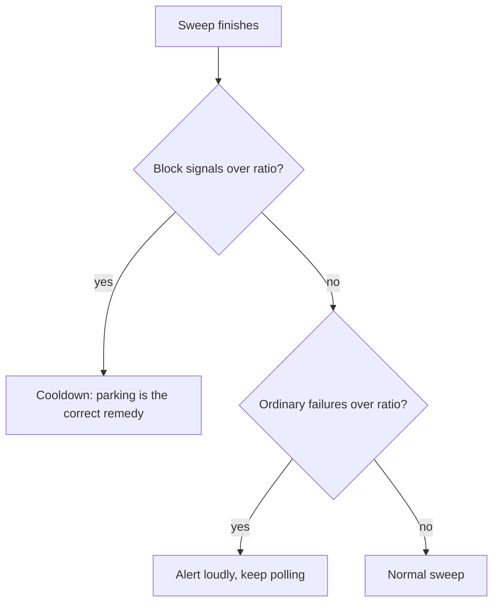
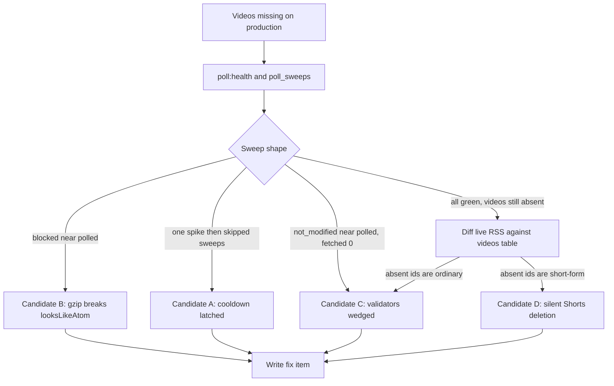
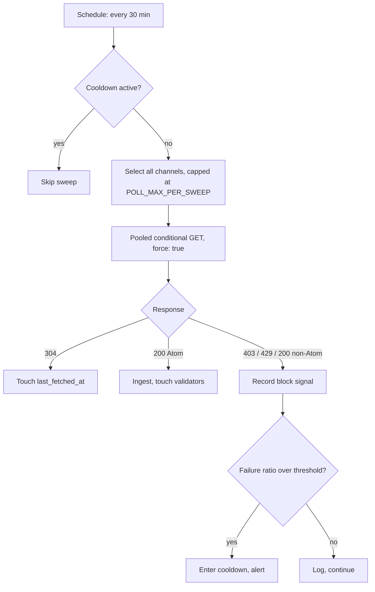

# Roadmap Done

## [036] Flag Shorts instead of destroying them

**Status:** `done`
**Mode:** `Auto`
**Depends On:** [032]

### Goal

Make Shorts filtering reversible and observable. `RssFetcher::ingest` currently hard-deletes the `videos` row and every attached `user_video_states` row for any entry whose Atom `alternate` href is under `/shorts/`, with no log line and no counter. [032] found no false positive in a ten-video sample and no stored row queued for deletion, so this is hardening rather than a bug fix, but a rule that destroys user data silently has no way to tell anyone when it is wrong.

### Scope

- Mark a video as short-form rather than deleting it, and filter it out of the feed at read time
- Keep `user_video_states` intact, so a misclassification never costs the user their watched state
- Count and log what the rule classifies, so a spike is visible
- Reconcile `videos:prune-shorts` with the new model, since it does the same deletion across the whole table using the watch-page canonical
- Fix or gate `poll:diagnose --shorts-probe`, which is unusable from a datacenter IP
- **Not in scope:** a user-facing setting for showing Shorts. Worth having, but a separate item

### Technical Notes

The deletion sits at `app/Services/RssFetcher.php:275-280`. `PruneShortVideosCommand` performs the equivalent via `YoutubeShortsDetector::isShortByWatchPage`, and is not scheduled: it only runs by hand.

Evidence from [032] section 6: ten of ten sampled `/shorts/`-href entries were genuinely short-form, all 61 seconds or under and nine of ten portrait, and a scan of 236 live `/shorts/` entries found zero currently stored. The RSS href tracks YouTube's own canonical closely.

`poll:diagnose --shorts-probe` is the tool that would catch a misfire, and it does not work where it is most needed. From the Forge box it returned `canonical=watch` with no duration and 140x100 dimensions for all ten Shorts, because YouTube serves a datacenter IP an interstitial with no player payload. From a residential IP the same probe returned `canonical=shorts` with real durations for all ten. Either make it detect the interstitial and say so, or refuse to run outside a context where it works. Silently printing a wrong classification is worse than printing nothing.

The residual risk is the boundary, not the accuracy. YouTube's Shorts ceiling is three minutes, so a 2:50 vertical upload is classified as a Short and deleted today, and nothing in the system records that it happened. A flag turns that from data loss into a filter the user could later disagree with.

**Shipped.** `videos.is_short` carries the flag. `RssFetcher::ingest` upserts a `/shorts/` entry with `is_short = true` instead of deleting the row and its `user_video_states`, and returns `array{stored, shorts}` rather than an int (`WebSubController` ignores the return; the callers in tests were updated). `fetchForChannels` sums the flagged count into `shorts_flagged`, which `channels:poll` prints and stores on `poll_sweeps.shorts_flagged`.

Both feed controllers filter `videos.is_short = false`, and the per-channel cap subquery in `Video::scopeUnwatchedCappedPerChannel` excludes flagged rows too, so a hidden Short cannot eat a slot in a channel's cap.

`videos:prune-shorts` flags instead of deleting, leaves `user_video_states` alone, and now skips rows already flagged, so a re-run costs one request per still-unclassified video rather than one per row in the table.

`poll:diagnose --shorts-probe` treats a page with no `approxDurationMs` as `unclassified` rather than printing `watch`, and warns loudly when every probed page comes back that way, which is what a datacenter IP sees. Its inter-request pause now follows `--sleep` instead of a hardcoded 400ms.

**From the adversarial pass.**

Fixed: `ingest` originally wrote `is_short` on every re-ingest, so a sweep would clear a flag `videos:prune-shorts` had just set from the watch page, and the video would reappear in the feed and be re-probed on every later run. The flag is now sticky: only ever set to true from the RSS href, never cleared. Regression test in `tests/Feature/RssFetcherTest.php`.

Fixed: added `videos_channel_short_published_index` on `(channel_id, is_short, published_at)`. Shorts are kept forever now, so without it both feed reads and the per-channel cap subquery reject short rows one at a time over a set that only grows.

Accepted, not fixed: the upsert in `ingest` keys on `youtube_video_id` alone, so an entry claiming a video ID already stored under another channel reassigns that row's `channel_id`. That predates this change, `videos.youtube_video_id` is `unique`, so widening the key to `(youtube_video_id, channel_id)` would turn the second claim into a constraint violation counted as `parse_error` rather than a fix, and the feed URL is always built server-side from a validated channel ID over HTTPS to youtube.com. Left as is.

Accepted, not fixed: `videos:prune-shorts` re-requests the watch page for every video the detector could not classify (`null`), on every run, with no backoff and no record of having tried. Run time therefore grows with the number of permanently-unclassifiable rows. It is a manual command, unscheduled, and the same was true before this change; a `shorts_checked_at` column would fix it if the command ever gets scheduled.

### Acceptance Criteria

- [x] A short-form entry is stored and flagged, not deleted
- [x] Feed reads exclude flagged videos
- [x] `user_video_states` survives a video being flagged
- [x] The number of entries flagged per sweep is counted and visible
- [x] `videos:prune-shorts` flags rather than deletes, and its existing behaviour is either migrated or documented as superseded
- [x] `poll:diagnose --shorts-probe` either detects the interstitial and reports it as unclassified, or refuses to run where it cannot work

### Tests

- [x] `tests/Feature/RssFetcherTest.php` - a `/shorts/` entry is stored with the flag set
- [x] `tests/Feature/RssFetcherTest.php` - an existing video and its watched state survive being reclassified as short-form
- [x] `tests/Feature/GroupFeedTest.php` - flagged videos do not appear in a feed
- [x] `tests/Feature/PruneShortVideosCommandTest.php` - the command flags instead of deleting

---

## [035] Cool down on block signals, not on ordinary failures

**Status:** `done`
**Mode:** `Auto`
**Depends On:** [032], [033]

### Goal

Stop a transport problem from parking ingestion for six hours at a time. `PollChannelsCommand::shouldCooldown` counts `failed + blocked` against its ratio, so a mechanism built for IP blocks fires on timeouts. On production this turned a partial fetch failure into 3 sweeps a day where the schedule asks for 48, which is the difference between degraded ingestion and near-total loss.

### Scope

- Trip the cooldown on block signals, not on the combined bad-response count
- Keep a separate, louder response to a sweep that fails wholesale for non-block reasons: it is a real emergency, it just is not a block, and parking for six hours is the wrong remedy
- Make the cooldown visible without a log dive, since `POLL_ALERT_WEBHOOK` is unset by default and one `Log::error` line is the only outward sign today
- **Not in scope:** the timeout values themselves ([034])

### Technical Notes

[029] recorded cooling down on non-block failures as "the safe direction", on the reasoning that a failure storm might be a block the detector missed. Production falsified that: the failure mode it actually caught was not a block, and the remedy made the symptom far worse than the disease. `blockSignal` already distinguishes the two cleanly, on 403, 429, and a non-Atom 200, and [032] confirmed it reads zero through a 97%-failure sweep.

The asymmetry worth preserving: a block is all-or-nothing and polling through it may extend it, so backing off is correct. A timeout storm is the opposite, where backing off guarantees loss and fixes nothing.



**Shipped.** `channels:poll` now measures two ratios against the same minimum sample: `blocked / attempted` trips the cooldown (`POLL_BLOCK_FAILURE_RATIO`), and `failed / attempted` raises a failure storm (`POLL_FAILURE_ALERT_RATIO`, default 0.5) that alerts loudly and keeps polling. A cooldown suppresses the storm signal, since a block is already the louder answer.

The webhook path moved out of `PollCooldown` into `PollAlert`, so one `POLL_ALERT_WEBHOOK` covers both conditions and neither ends up visible only in `laravel.log`. `poll_sweeps.failure_alert` records the storm, and `poll:health` prints cooldowns and failure storms as separate counts alongside the [033] category breakdown.

`RssBlockDetectionTest` carried a test asserting the [029] behaviour ("a sweep that only fails without block signals still enters cooldown"); it now asserts the reversal.

### Acceptance Criteria

- [x] The cooldown trips on block signals alone
- [x] A sweep that fails wholesale for non-block reasons keeps polling and raises a distinct, loud signal
- [x] The two conditions are distinguishable in `poll_sweeps` and in `poll:health` after the fact
- [x] A cooldown, once tripped, is still visible without reading `laravel.log`

### Tests

- [x] `tests/Feature/ChannelsPollCommandTest.php` - a sweep of transport failures does not trip the cooldown
- [x] `tests/Feature/ChannelsPollCommandTest.php` - a sweep of block signals still does
- [x] `tests/Feature/ChannelsPollCommandTest.php` - a wholesale non-block failure raises the distinct signal
- [x] `tests/Feature/PollHealthCommandTest.php` - the two conditions read differently in the health report

---

## [033] Record the transport failure behind a failed poll

**Status:** `done`
**Mode:** `Auto`
**Depends On:** [032]

### Goal

Make a failed RSS poll say what actually went wrong. Today `RssFetcher` logs the literal string `no_response` for every `Response`-less outcome, so DNS failure, TLS handshake failure, connect timeout, and read timeout are indistinguishable after the fact. On production this blind spot turned 560 failures in 24 hours into an unreadable log, and forced [032] to build a bespoke command to learn anything at all.

### Scope

- Catch the transport exception in `RssFetcher::fetchForChannels` and log its class and message alongside the channel
- Classify the outcome coarsely enough to count: connect timeout, read timeout, DNS, TLS, other
- Surface the classification in `poll:health` and in the sweep record, so the shape of a failure storm is readable without a log dive
- **Not in scope:** changing any timeout value. That is [034]

### Technical Notes

`Http::pool` returns the `Throwable` in the response slot rather than throwing, which is why `$resp instanceof Response` is false and the current code falls through to `'status' => 'no_response'` at `app/Services/RssFetcher.php:104-111`. The exception is already in hand and is simply discarded. Guzzle raises `ConnectException` for connect-phase failures, DNS and TLS included and distinguishable by the cURL errno in the message, and `RequestException` for a read timeout.

This is the cheapest item of the four and every other one is easier to verify once it lands, so build it first.

Categories recorded: `dns`, `tls`, `connect_failed`, `connect_timeout`, `read_timeout`, `empty_response`, `other` for transport, plus `http_error` for a non-2xx response and `parse_error` for a body that fails to parse. All of them land in the same `failed` counter, so the category map reconciles with it. `fetchForChannels` now returns a `failures` key, `poll_sweeps.failure_categories` stores it as JSON, and `poll:health` prints the breakdown with the dominant category named.

Errno 28 covers both timeout kinds; only the message text separates them ("Connection timed out" for connect phase, "Operation timed out ... with 0 bytes received" for the accepted-but-silent case that [032] measured).

### Acceptance Criteria

- [x] A poll that fails without a response logs the exception class and message, not the bare string `no_response`
- [x] Failures are counted by coarse category, and the category counts survive into the sweep record
- [x] `poll:health` reports the dominant failure category over its window
- [x] Nothing about the success path or the block-signal path changes

### Tests

- [x] `tests/Feature/RssFetcherTest.php` - a connect exception is logged with its class and message
- [x] `tests/Feature/RssFetcherTest.php` - a read timeout and a connect timeout land in different categories
- [x] `tests/Feature/PollHealthCommandTest.php` - the health report names the dominant failure category

---

## [032] Diagnose missing videos since the [029] polling deploy

**Status:** `done`
**Mode:** `Manual`
**Depends On:** [029]

### Goal

Find out why uploads are still going missing on production now that scheduled polling is the ingestion backbone, and separate the new-since-[029] causes from the pre-existing one the user suspects predates the WebSub work. As with [028], the output is a proven cause plus a specified fix item, not a ranked suspicion.

### Scope

- Read the production sweep record and decide, from data, which of the candidate mechanisms is actually firing
- Cover both the post-[029] regression candidates and the pre-existing silent-deletion candidate
- Confirm which specific videos are missing, by comparing a channel's live RSS against what the database holds
- Record the cause and hand the build to a follow-up item
- Ship the diagnosis tooling itself as `poll:diagnose`, because production readings have to be repeatable by whoever runs the fix items
- **Not in scope:** implementing any fix. Each confirmed cause becomes its own item

### Technical Notes

**Context.** [028] proved YouTube's publisher does not reliably ping its own hub, and [029] made a 30-minute `channels:poll` sweep the sole automatic ingestion path. The user reports, on the post-[029] production deploy: a few new videos arrived, but videos were apparently missing this morning. Nothing about the UI visibly broke. The user also suspects a longer-standing bug, because the original [021] WebSub deploy surfaced a batch of videos that had been missing before push existed at all.

That last observation matters. A backlog appearing the moment a *new* ingestion path opened means videos were absent from the database while the old path reported healthy. That is the signature of a silent drop, not of a fetch failure.

**Candidate A. The cooldown latched and parked ingestion.** `PollChannelsCommand::shouldCooldown` trips when `(failed + blocked) / attempted >= POLL_BLOCK_FAILURE_RATIO` (0.5) on a sweep of at least `POLL_BLOCK_MIN_SAMPLE` (5). `PollCooldown::start` then parks every automatic fetch for `POLL_COOLDOWN_HOURS` (6). `POLL_ALERT_WEBHOOK` is unset by default, so the only outward sign is one `Log::error` line. A single bad sweep overnight is a six-hour ingestion blackout that looks exactly like "missing this morning". [029] accepted this risk explicitly. The question is whether it fired.

**Candidate B. `blockSignal` false-positives on every response.** `RssFetcher::pollHeaders` sets `Accept-Encoding: gzip, deflate` by hand. Guzzle decodes transparently only when it owns that header, so a manually set value can leave the body compressed. `looksLikeAtom()` then fails its `<feed` match on all 193 channels, every 200 is classified `non_atom_200`, the ratio is 1.0, and the cooldown trips on the first sweep and re-trips every six hours indefinitely. This is new in [029] and would produce both reported symptoms at once. Cheap to falsify: `blocked` would sit at or near `channels_polled` on every row of `poll_sweeps`.

**Candidate C. Conditional-GET validators wedged on a stale response.** Also new in [029]. `rss_etag` and `rss_last_modified` are stored after a successful ingest and replayed as `If-None-Match` / `If-Modified-Since`. A 304 touches `last_fetched_at` and ingests nothing. If YouTube's edge answers 304 against a validator captured from a stale edge node, that channel is frozen at the videos it held when the validator was stored, and every health signal reads perfect: zero failures, zero blocks, zero staleness. `force: true` does not help, because force bypasses the TTL, not the validators, so `GroupFeedController::refresh` cannot break out of it either. This candidate best matches "missing videos with nothing visibly wrong", and it is the one [028]'s evidence gotchas would have missed again.

**Candidate D. Silent Shorts deletion, pre-existing.** `RssFetcher::ingest()` hard-deletes the `videos` row and its `user_video_states` rows for any entry whose Atom `alternate` href is under `/shorts/`, with no log line and no counter. `videos:prune-shorts` does the same across the whole table using the watch-page canonical URL from `YoutubeShortsDetector`. YouTube canonicalises short-form and vertical uploads under `/shorts/` liberally, so ordinary uploads can be classified as Shorts and destroyed, taking the user's watched state with them. This predates WebSub entirely and is the strongest explanation for the "this was broken before" instinct. It is also self-concealing: the video reappears on a later sweep if the href changes, then vanishes again.

**Candidate E. Timeouts tuned for a page request, not a sweep.** `RssFetcher`'s 2.0s connect and 3.0s total defaults date from when fetching happened inside an Inertia deferred prop. A sweep has no such constraint, and every timeout counts as `failed`, feeding Candidate A's ratio.

**Discriminating between them.** Cheap, mostly one reading each, run on production:

| Reading | How | Tells you |
| --- | --- | --- |
| Cooldown state and staleness | `php artisan poll:health` | Candidate A directly, and rules Candidate C in if everything reads green while videos are missing |
| Sweep history | `select started_at, channels_polled, fetched, not_modified, failed, blocked, cooldown_triggered from poll_sweeps order by started_at desc limit 48;` | A vs B vs C. `blocked` near `channels_polled` is B. `not_modified` near `channels_polled` with `fetched` at 0 across a full day is C. One spike then skipped sweeps is A |
| Cooldown log lines | `/bin/grep 'Polling cooldown started' storage/logs/laravel.log` | When A fired, and the reason recorded |
| Validator bypass | Null `rss_etag` and `rss_last_modified` for one known-missing channel, then `php artisan channels:poll --limit=1 --ignore-cooldown` | Confirms C if the missing videos land immediately |
| Ground truth per channel | Fetch that channel's RSS by hand and diff the 15 `yt:videoId` values against `videos` | Names exactly which uploads are absent, and whether they are short-form |
| Deletion churn | Look for a known-missing video id in `user_video_states` | D leaves no row behind, so a video the user had marked watched returning unwatched is a tell |

The [028] evidence gotchas still apply: an empty `laravel.log` proves nothing, `grep -c` with zero matches exits non-zero and silently breaks an `&&` chain, and `/bin/grep` is the working path on the Forge box.

**Production readings, 2026-08-25 (~13:00-19:00 UTC).** `poll:health` plus the last 48 `poll_sweeps` rows:

```
Cooldown: ACTIVE until 2026-08-25T19:00:29+00:00 (178 of 193 requests failed (0 of them block signals)).
Staleness: 193 channels, max 1464 min, median 1463 min, never fetched 0.
Last 24h: 3 sweeps, 579 polls, 560 fetch failures, 0 block signals, 0 cap hits, 3 cooldowns.
All rss_url values are canonical.
2026-08-25 13:00:04 polled=193 fetched=15 notmod=0 failed=178 blocked=0 cooldown=1
2026-08-25 06:30:03 polled=193 fetched=3  notmod=0 failed=190 blocked=0 cooldown=1
2026-08-25 00:00:13 polled=193 fetched=1  notmod=0 failed=192 blocked=0 cooldown=1
```

| Candidate | Reading | Verdict |
| --- | --- | --- |
| B, gzip breaks `looksLikeAtom` | `blocked = 0` on every sweep | **Eliminated** |
| C, validators wedged | `not_modified = 0` on every sweep, so no 304 has ever been served | **Eliminated** |
| A, cooldown latched | 3 cooldowns across 3 sweeps | **Real, but a symptom** |
| E, timeouts | 560 of 579 polls failed with 0 block signals | **Leading root cause** |

The failures are not 403, 429, or a non-Atom 200, and they are not 304. `RssFetcher` logs them with `'status' => 'no_response'`, meaning no `Response` object came back at all: a connect or read timeout, or a transport-level error, against the 2.0s connect / 3.0s total defaults.

Two things this changes about the item:

- **A is downstream of E, not a separate cause.** Every sweep trips the ratio, so polling runs 3 times a day instead of 48. The [029] note that a cooldown on non-block failures is "the safe direction" is falsified in practice: it converts a partial fetch problem into near-total ingestion loss. The cooldown should distinguish block signals from ordinary failures.
- **The `no_response` log carries no exception message**, so the failure mode cannot be read back from `laravel.log`. That is the gap to close first, alongside the timing question of whether generous timeouts succeed where 2.0/3.0 fail. If both tight and generous timeouts fail, the cause is egress-level (DNS, TLS, or an IP-level refusal that never reaches HTTP) which is exactly why block detection reads zero.

**Candidate D is untouched by these readings.** It deletes rows after a *successful* fetch, so it is orthogonal to the failure storm and still needs its own check.

**Divergence from plan, 2026-08-25.** Two things changed while executing this item.

*The diagnosis tooling shipped as code.* `poll:diagnose` (`app/Console/Commands/DiagnosePollingCommand.php`) replaces the throwaway tinker script the plan assumed. `php artisan tinker <file>` drops into an interactive shell after including the file, which is useless over a non-interactive ssh, and the readings this item needs are the same readings every fix item ([033] through [036]) will need to verify itself. Five sections: sweep history, single-fetch timing tight against generous with the exception class captured, pool timing in the sweep's real concurrent shape, a live-RSS-against-`videos` diff naming every absent upload, and the deletion tells. Read-only, covered by `tests/Feature/DiagnosePollingCommandTest.php`. So "this item builds nothing" is no longer true: it builds the instrument, not the fix.

*Candidate D is eliminated on local evidence, pending a production confirmation.* Ten `/shorts/`-href entries checked against their watch pages agree with YouTube's own canonical in ten of ten, all 61 seconds or under, nine of ten portrait. A scan of 236 live `/shorts/` entries found zero currently stored in `videos`, so nothing is queued for silent deletion. The design objection survives as [036]: the rule deletes rather than flags, takes `user_video_states` with it, and leaves no trace, so a future misfire would be invisible.

**Production readings, 16:21 UTC, after `poll:diagnose` deployed.** These overturn the working conclusion above, and are written up in full as sections 12 through 15 of `reference/POLLING_LOSS_INVESTIGATION.md`.

*Candidate E is real but was framed wrongly.* Single requests from the Forge box succeed on the sweep's own 2.0s/3.0s budget at 65-321ms, faster than the residential control. One batch of 20 concurrent loses 1 request to `cURL error 28: Operation timed out after 3002 milliseconds with 0 bytes received`, while the same 20 all pass on a generous budget in 1146ms. All 193 channels fetched sequentially with a 150ms gap: zero failures. The decisive datum is that `fetched` on the three real sweeps reads 15, 3, and 1 against a pool chunk of 20 — roughly the first chunk gets through and everything after it is answered with silence. **YouTube tarpits the 20-way burst, and the 3s budget converts that silence into a failure.** A bigger timeout alone buys a longer wait for the same silence, which is why [034] is re-scoped from timeouts to pacing.

*The loss is much smaller than the failure rate suggests.* Of 2830 live RSS entries, 841 are absent from `videos` and 829 of those are Shorts excluded by design. **Twelve ordinary uploads are missing.** Named: `6CXO8bVONug` on `UCIuDdCJXnKZb4CUzhVO-DcQ`, published 2026-08-25T07:09:49+00:00, canonical `/watch`; and `N54TzB6AiSU` on `UCwaTGE53GLGC3fDClVl_7TA`, published 2026-08-25T14:36:14+00:00. Both `states=0`, both published after a sweep that reached 3 channels of 193. Never ingested, not ingested-then-deleted.

*Candidate D eliminated on production evidence.* Zero stored rows queued for deletion, zero orphaned `user_video_states` against 331 rows and 4207 videos.

*`--shorts-probe` is unusable from the Forge box.* It returned `canonical=watch` with no duration and 140x100 dimensions for every Short, because YouTube serves a datacenter IP an interstitial with no player payload. That table is the probe failing, not a classification, and must not be read as evidence. Fixing or gating it belongs with [036].



### Acceptance Criteria

- [x] The production sweep record is read, and Candidates A, B, C, and E are each confirmed or eliminated from `poll_sweeps` data rather than from reasoning
- [x] It is established whether a cooldown has fired since the [029] deploy, when, and for what recorded reason
- [x] At least one specific missing video is identified by id, with its channel, publish time, and whether YouTube canonicalises it under `/shorts/`
- [x] A live RSS fetch for that channel is diffed against the `videos` table, proving whether the entry was never ingested or was ingested and later deleted
- [x] Candidate D is confirmed or eliminated by checking whether missing ids are short-form and whether their `user_video_states` rows are gone
- [x] Separate verdicts are recorded for the post-[029] regression and for the pre-existing loss observed at the [021] deploy, since they may be different causes
- [x] Findings are written to `reference/POLLING_LOSS_INVESTIGATION.md` with the reproduction commands and the readings they returned
- [x] Each confirmed cause is specified as a follow-up roadmap item, [033] through [036]

### Verification (no automated tests)

This is a diagnosis, so there is nothing to assert. Every criterion is verified by direct observation against production, with the commands recorded in the reference document. [028] is the precedent: a suite mocking the RSS endpoint stayed green through a twenty-hour outage, because every in-process signal read healthy. Candidate C has that same property, which is why it needs a production reading rather than a test.

---

## [029] Make scheduled polling the ingestion backbone

**Status:** `done`
**Depends On:** none

### Goal

Videos arrive on a predictable schedule driven entirely by our own polling, and the health of that polling is a reportable state rather than a tinker session. [028] proved YouTube's publisher does not reliably ping its own hub for our feeds, so push cannot be the guaranteed path. This item builds the path that can be guaranteed. [030] then removes WebSub, and depends on this landing first.

### Scope

- A scheduled sweep every 30 minutes that polls **every** channel, as the sole automatic ingestion path
- Block detection and a cooldown, since a YouTube RSS block does not announce itself as a 429
- A poll health command, so staleness and fetch failures are visible without a tinker session
- The `channels.rss_url` deviation check carried over from [028]
- **Not in scope:** removing any WebSub code. That is [030], and it must land after this
- **Not in scope:** anything that scales polling past one server IP. That is [031], deliberately deferred

### Technical Notes

**Ingestion is push-only today.** `RssFetcher::fetchForChannels` is reached only from the failure-driven backstop and the manual group refresh. The backstop is gated behind `backstop_min_silence_hours` (48) and `backstop_min_repoll_hours` (6), and every failure signal read healthy during the [028] outage, so it was a no-op while ~95% of uploads went missing. Feed reads are pure DB (`AllVideosFeedController.php:27`, `GroupFeedController.php:27`), so nothing else fetches.

**Poll everything, every 30 minutes.** Add a `channels:poll` command scheduled on `->everyThirtyMinutes()` that polls the full channel table in one sweep. At the current 193 channels that is 386 requests/hour, roughly 9,300/day, and a uniform 30-minute upload-to-feed latency on every channel.

This is deliberately the simple scheme. A rotation budget, stalest-first selection, and demand-ordered polling were all considered and rejected **for now** as complexity that buys nothing at 193 channels. They buy a great deal at 10,000, which is why they are written up in [031] rather than discarded. The crossover is roughly the point where a full sweep stops fitting inside the safe request rate for a single IP, and that rate is unknown (see below).

**Keep a safety cap.** Take a `POLL_MAX_PER_SWEEP` env value, defaulting high enough to be a no-op at current scale (say 1,000). It is not a rotation mechanism and needs no stalest-first selection. It exists so a bulk channel import cannot silently multiply the outbound request rate overnight. A sweep hitting the cap is the signal to build [031].

**The sweep passes `force: true`.** `RssFetcher` filters by its 30-minute TTL (`isStale`). A sweep scheduled at exactly 30 minutes will drift and find channels at 29-point-something minutes old, silently skipping them until the following sweep and so doubling their real interval to an hour. `force: true` makes the schedule the only interval control.

**Block detection is not optional.** `reference/YOUTUBE_RSS_RATE_LIMITS.md` section 5.2 records that a YouTube RSS block does **not** arrive as a 429. Across every documented case it is an HTTP 403, or an HTTP 200 whose body is Google's "automated queries" HTML interstitial rather than Atom XML. A health metric counting only 429s would have read zero through all of them. `RssFetcher` should treat each of these as a block signal:

| Signal | Meaning |
| --- | --- |
| HTTP 403 | IP-scoped soft block |
| HTTP 429 | Rate limit, rarely seen in practice |
| HTTP 200, body is not valid Atom | The interstitial |
| Sweep-wide failure ratio spike | The most reliable tell: blocks are all-or-nothing, not gradual |

On detection, record it and **pause polling for a cooldown** rather than continuing. Blocks are IP-scoped and last hours to about a day. Retrying through one wastes requests and may extend it.

**Conditional GET does not buy ceiling headroom.** `RssFetcher::pollHeaders` sends `If-None-Match` / `If-Modified-Since` and 304s are handled at `RssFetcher.php:76-88`, so most of a sweep transfers no body. That saves bandwidth and parse time. It does **not** reduce the request count, which is what an IP-scoped block counts. Do not read the 304 rate as safety margin.

**Poll health command.** Nothing currently surfaces whether the sweep is keeping up. Add a command reporting max and median channel staleness (`now() - last_fetched_at`), fetch failure counts, and block-signal counts over a recent window. This is what makes the acceptance criteria checkable, and it replaces the drought-detection role that WebSub's `alert_webhook` never filled (it fires only on renewal failure, which stayed at 0 throughout the [028] outage).

**`rss_url` deviation.** Fold into the health command: surface any channel whose stored `channels.rss_url` differs from the canonical form built from `channel_id`. Currently 0 of 193 deviate, but `Channel::rssUrl()` prefers the stored column, so a legacy odd row silently breaks that channel's polling the same way it broke its push topic in [028].

**Keep `GroupFeedController::refresh`.** The manual force-refresh route stays as the escape hatch when a channel is mid-interval.

### What landed

| Piece | Where |
| --- | --- |
| Sweep command | `app/Console/Commands/PollChannelsCommand.php`, scheduled in `routes/console.php` |
| Block signals | `RssFetcher::blockSignal()` / `looksLikeAtom()`, surfaced as a new `blocked` key in the result array |
| Cooldown | `app/Services/PollCooldown.php`, a cache-backed deadline with an optional `POLL_ALERT_WEBHOOK` |
| Sweep history | `poll_sweeps` table and `App\Models\PollSweep`, pruned to `POLL_SWEEP_HISTORY_DAYS` (30) by each sweep |
| Health report | `app/Console/Commands/PollHealthCommand.php` (`poll:health`) |
| Config | `services.polling.*`, documented in `.env.example` |

### Decisions taken during the adversarial pass

**Stalest-first ordering, even though the cap is not a rotation mechanism.** The sweep orders never-fetched channels first, then oldest `last_fetched_at`. A plain `orderBy('id')` would mean that if the cap is ever hit, the same lowest-id channels are polled forever and everything past the cap is never polled again: a silent permanent blackout rather than a delay. Ordering costs nothing and degrades the cap into slower whole-table coverage instead. It is still not a rotation budget; [031] owns that.

**The cooldown gates the WebSub backstop too, not just the sweep.** A block is IP-scoped, so it applies to every automatic fetch path. `websub:backstop` now returns early while a cooldown is active. `GroupFeedController::refresh` and the on-add backfill are deliberately not gated: both are human-initiated, bounded to one group or one channel, and the refresh route is the documented escape hatch.

**The `blocked` count is propagated to every existing caller.** `GroupFeedController::refresh` previously read only `failed`, so a group whose channels all came back 403 would have shown a green "Refreshed 0 channels (failed: 0)" toast.

**Accepted, not fixed:**

- The cooldown trips on a high sweep-wide failure ratio even when zero responses carried a block signal, so an unrelated egress or DNS incident can pause ingestion for `POLL_COOLDOWN_HOURS`. This is the acceptance criterion as written, and pausing is the safe direction: the alternative is hammering an origin during an incident the process cannot characterise from the inside.
- `RssFetcher::ingest()` runs one `Video::updateOrCreate` per feed entry, so a clean sweep is roughly 15 round trips per channel. Fine at 193 channels; a bulk upsert belongs with the rest of the scaling work in [031].
- `withoutOverlapping(29)` expires the schedule mutex just under the 30-minute cadence, so a sweep running longer than 29 minutes could stack with the next tick. At 193 channels a sweep is ten sequential pool batches, nowhere near that.
- `poll:health` pulls every `last_fetched_at` into PHP to compute the median and scans the whole channel table for `rss_url` deviations. Linear in channel count, run by hand, not on a schedule.



### Tests

Cover the mechanically testable parts only:

- [x] `tests/Feature/ChannelsPollCommandTest::it_polls_every_channel_in_one_sweep`
- [x] `tests/Feature/ChannelsPollCommandTest::it_forces_past_the_ttl_so_a_recently_fetched_channel_is_not_skipped`
- [x] `tests/Feature/ChannelsPollCommandTest::it_caps_a_sweep_at_the_configured_maximum`
- [x] `tests/Feature/ChannelsPollCommandTest::it_polls_everything_when_the_channel_count_is_under_the_cap`
- [x] `tests/Feature/RssBlockDetectionTest::it_counts_a_403_as_a_block_signal`
- [x] `tests/Feature/RssBlockDetectionTest::it_counts_a_200_with_a_non_atom_body_as_a_block_signal`
- [x] `tests/Feature/RssBlockDetectionTest::it_enters_cooldown_when_the_sweep_failure_ratio_crosses_the_threshold`
- [x] `tests/Feature/RssBlockDetectionTest::it_skips_the_sweep_while_cooldown_is_active`
- [x] `tests/Feature/PollHealthCommandTest::it_reports_an_rss_url_deviation`
- [x] `tests/Feature/PollHealthCommandTest::it_reports_no_deviation_when_every_rss_url_is_canonical`

Added during the adversarial pass:

- [x] `tests/Feature/RssBlockDetectionTest::it_skips_the_websub_backstop_while_cooldown_is_active`
- [x] `tests/Feature/RssBlockDetectionTest::a_sweep_that_only_fails_without_block_signals_still_enters_cooldown`

**Not covered by tests, verified on production instead.** The block threshold is YouTube's, unpublished, and observable only in production. A faked client proves the code issues N requests, not that N is safe. [028] was invisible precisely because every in-process signal read healthy, so a suite mocking the RSS endpoint would have stayed green through all 20 hours of it. The real safety of 386 requests/hour, and end-to-end upload latency, are verified by running the sweep on production for a full day.

### Acceptance Criteria

- [x] A scheduled `channels:poll` runs every 30 minutes and polls every channel in the table
- [x] The sweep passes `force: true`, so the schedule is the only interval control and TTL drift never skips a channel
- [x] A `POLL_MAX_PER_SWEEP` safety cap exists, defaults high enough to be a no-op at current scale, and is logged loudly if ever hit
- [x] `RssFetcher` counts HTTP 403, HTTP 429, and a non-Atom HTTP 200 body as block signals rather than as ordinary failures
- [x] A sweep-wide failure ratio over the threshold triggers a cooldown that pauses polling instead of retrying
- [x] One health command reports max and median channel staleness, fetch failure counts, and block-signal counts
- [x] That command surfaces any channel whose stored `channels.rss_url` deviates from the canonical `channel_id` form
- [x] The manual `GroupFeedController::refresh` route still force-fetches a group

---

## [028] Diagnose the WebSub delivery drought

**Status:** `done`
**Mode:** `Manual`
**Depends On:** [021], [022], [027]

### Goal

Find out why the feed stopped receiving new videos after the [021]/[022]/[027] deploy, with a green scheduler, zero errors, and healthy subscriptions. Prove the cause rather than guess at it, and decide what the ingestion architecture has to become. Full write-up: `reference/WEBSUB_DELIVERY_INVESTIGATION.md`. The fix itself is [029].

### Scope

- Establish whether uploads were happening at all, and whether polling still worked
- Rule in or out every layer between YouTube and the database: publisher, hub, Cloudflare edge, callback route, HMAC, subscription rows, scheduler
- Reach a proven root cause, not a ranked suspicion
- Record the design consequence and hand the build to a follow-up item

### Findings

A single forced poll of all 193 channels recovered **14 videos** that push had never delivered (4190 to 4204), newest published 15:15 that day, with 0 fetch failures. Uploads were happening; WebSub was not delivering them.

Production state at diagnosis:

| Signal | Value | Reading |
| --- | --- | --- |
| subscriptions by status | 193/193 `active` | hub verified every callback |
| `last_verified_at` (max) | 2026-08-23 19:17 | all subscribed at deploy |
| `expires_at` (min) | 2026-08-28 19:15 | leases healthy, 5-day Google grant |
| `never_delivered` | 191 of 193 | ~2 POSTs landed in 20 hours |
| `delivery_failed_at` / `renewal_failures` | 0 / 0 | nothing on our side threw |
| `laravel.log` | 315 bytes | no trace of a real hub POST |

**Root cause: YouTube's publisher does not reliably ping its own hub for these feeds.** Google's hub exposes per-subscription state at `pubsubhubbub.appspot.com/subscription-details` (requires `hub.callback`, `hub.topic`, and the real `hub.secret`). Ten subscriptions were read: 3 random plus 7 belonging to channels among the 14 recovered uploads, so channels with a *proven* post-subscribe upload. All ten read identically: State `verified`, verification at deploy time, expiration 2026-08-28, and **Content received: n/a**, Content delivered: n/a, 0 delivery requests, 0% errors.

Content received `n/a` on a topic with a proven upload means the hub never got the content. There were no failed deliveries to us, there was nothing to deliver. The loss sits upstream of the hub, above anything our side can touch. Externally corroborated by [Google issue 204101548](https://issuetracker.google.com/issues/204101548) (subscribe verifies, callback never fires).

Everything else is eliminated:

| Hypothesis | Verdict |
| --- | --- |
| Topic-string mismatch | **Dead.** 0 mismatches of 193 against the canonical `channel_id` form |
| Structural difference in our rows | **Dead.** Rows uniform, and the hub confirms every sampled subscription correctly registered |
| Burst-subscribe throttling | **Moot.** Delivery-side throttling cannot explain content the hub never received |
| Cloudflare / the edge | **Ruled out.** 7 mitigated of 1.18k requests, 89 POSTs zone-wide in 24h, Bot Fight Mode off; the only `/websub/` rows are our own diagnostic probes |
| Our callback / receive path | **Ruled out.** Reachable externally, and a correctly-signed self-POST of a real feed body returns `200 OK` and ingests |
| Secret / token mismatch | **Ruled out.** `postSubscribe` sends the same persisted `secret` and `callback_token` it stores; `ensureSubscribed` and `renew` reuse them |
| The scheduler | **Ruled out.** A duplicate broken Forge cron was found and deleted; the remaining `schedule:run` entry shows `websub:renew` and `websub:backstop` both due `0 * * * *` |

### Design consequence

WebSub cannot be the sole ingestion path. It is an accelerator for the cases where YouTube chooses to ping, and nothing on our side can make it fire. Polling has to be the backbone: a fixed hourly stalest-first budget, plus a drought signal, plus the `Pending` backstop hole. Specified and handed to **[029]**.

Two secondary findings carried forward into [029]:

- **Latent risk.** `Channel::rssUrl()` returns the stored `channels.rss_url` column first and only falls back to building the canonical string (`Channel.php:44`). Every current writer builds the canonical form, so nothing is wrong today, but a legacy row with an odd `rss_url` would produce this exact outage signature.
- **Backstop coverage hole.** `WebSubBackstopCommand::reasonToRepoll` never fires for a subscription stuck `Pending`: `leaseHasLapsed` short-circuits on `status !== Active`, and `silenceAnomaly` needs `count >= 3` uploads plus 48 hours of silence.

### Evidence gotchas for future debugging

- An empty `laravel.log` is **not** evidence that pushes are absent. A successful delivery logs nothing at all; only `last_delivery_at` distinguishes the two cases.
- Nginx silence proves nothing. Forge sets `access_log off;` per site, and `/var/log/nginx/access.log` is the catch-all server block.
- `grep -c` with zero matches exits non-zero and will silently break an `&&` chain. Chain diagnostic greps with `;`.
- On the Forge box `grep` is not on the login shell's `PATH`; `/bin/grep` works.

### Acceptance Criteria

- [x] Confirmed uploads were actually happening: a forced poll recovered 14 videos push never delivered
- [x] Confirmed RSS polling is healthy as a fallback path: 193 fetched, 0 failed
- [x] The broken duplicate "Websub" Forge cron job is deleted, leaving one correct `schedule:run` entry
- [x] Cloudflare ruled out: 7 mitigated of 1.18k requests, no hub POSTs reaching the edge at all
- [x] Callback reachability, HMAC verification, and end-to-end ingest confirmed working by a signed self-POST returning `200 OK`
- [x] Secret and callback-token mismatch ruled out by reading `postSubscribe`, `ensureSubscribed`, and `renew`
- [x] Topic strings verified canonical across all rows: 0 mismatches of 193
- [x] Root cause proven hub-side, not merely ranked: `subscription-details` reports "Content received: n/a" on topics with proven uploads
- [x] The two secondary defects (`rss_url` latent risk, `Pending` backstop hole) are recorded and handed forward
- [x] Findings written to `reference/WEBSUB_DELIVERY_INVESTIGATION.md` with reproduction commands and evidence gotchas
- [x] The architectural verdict is decided and specified as a follow-up item: polling becomes the backbone, WebSub stays as an accelerator ([029])

### Verification (no automated tests)

Nothing was built here, so there is nothing to assert. This item is a diagnosis: its output is a proven cause, a reference document, and a specified follow-up. Every criterion was verified by direct observation against production, and the commands to reproduce each reading are in `reference/WEBSUB_DELIVERY_INVESTIGATION.md` (sections 4, 7, and 11.5).

---

## [027] Subscribe channels missing a WebSub subscription (`websub:subscribe-missing`)

**Status:** `done`
**Mode:** `Auto`
**Depends On:** [021], [022]

### Goal

Close the gap where a channel exists in the database but has no `channel_subscriptions` row at all, so push never reaches it. A channel only ever gets subscribed at the moment it is added, which leaves any channel predating WebSub — or every channel in a database that was never the one the hub was pointed at — permanently push-less. Provide a manually run artisan sweep that subscribes and backfills those channels.

### Scope

- A new `websub:subscribe-missing` artisan command, run on demand, not scheduled
- `--dry-run` to list candidates without touching RSS or the hub, and an optional `--limit` to pace a large first run
- Aggregated alerting on subscribe failure, mirroring the existing renewal alert
- Explicitly NOT in scope: rows that exist but are unhealthy (`failed`, or never verified). `websub:renew` already retries those, and a second command POSTing the same subscribe would double up on the hub
- Explicitly NOT in scope: scheduling. This is a deploy-time and recovery tool, not ongoing bookkeeping

### Technical Notes

- The gap exists because `WebSubSubscriber::ensureSubscribed()` has exactly one caller, `SubscriptionController::store` (`SubscriptionController.php:101`). Nothing reaches a channel that is already in the table
- `WebSubBackstopCommand::reasonToRepoll()` already returns `'no websub subscription'` for these channels, so their video data does stay fresh over RSS. What was missing was only the subscription itself, which is why the hole is invisible in the feed
- The command reuses `ensureSubscribed()` rather than reimplementing subscribe logic, so it inherits the same backfill-then-subscribe ordering and idempotence. Re-running after a partial or interrupted run only picks up what is still missing
- Each subscribe also backfills that channel over RSS, so a first run against a large database is slow. `--limit` exists to pace it; the default is no limit
- `WebSubAlerter::subscribesFailed()` was added alongside the existing `renewalsFailed()`, same shape: one `Log::error` and one webhook POST per run, capped channel-id sample, ids sanitized before leaving the app
- Primary use is a deploy to an environment whose database has no `callback_token` rows the hub knows about. Hub subscriptions are keyed on `(topic, callback URL)`, so a new environment on its own hostname starts with zero live subscriptions regardless of what the previous one had

### Tests

- [x] `tests/Feature/WebSubSubscribeMissingTest.php` — a channel with no subscription row is subscribed at the hub and backfilled, with topic, callback token, and secret populated
- [x] `tests/Feature/WebSubSubscribeMissingTest.php` — a channel with an active subscription is left untouched and its `callback_token` is not rotated
- [x] `tests/Feature/WebSubSubscribeMissingTest.php` — a `failed` subscription is also left alone, since `websub:renew` owns that retry
- [x] `tests/Feature/WebSubSubscribeMissingTest.php` — `--limit` caps the run and warns that channels may remain; without it the run is unbounded
- [x] `tests/Feature/WebSubSubscribeMissingTest.php` — `--dry-run` reports candidates and sends no HTTP requests at all
- [x] `tests/Feature/WebSubSubscribeMissingTest.php` — a hub rejection marks the subscription `failed` and raises the aggregated alert

### Acceptance Criteria

- [x] Running the command subscribes and backfills every channel that has no subscription row
- [x] Re-running it is a no-op and reports that every channel is already subscribed
- [x] Existing subscriptions, healthy or failed, are never modified by the command
- [x] `--dry-run` previews the candidate list without contacting the hub or YouTube
- [x] The command is not registered on the scheduler; `schedule:list` shows only `websub:renew` and `websub:backstop`

---

## [026] Stop the whole grid flashing when a video's state changes

**Status:** `done`
**Mode:** `auto`
**Depends On:** none

### Goal

Marking a video watched or unwatched updates that one card. It no longer blanks every card on the page to the loading skeleton for a frame, and no longer discards infinite-scroll progress.

### Scope

- Write video state over plain XHR instead of an Inertia visit
- Return `204` from the state endpoint for XHR callers, keeping the redirect for normal form posts
- Keep the cap-on refetch, but as a partial reload that leaves the current cards on screen

### Technical Notes

- Root cause: `VideoStateController::store` returned `back()`, so `router.post` performed a full Inertia visit. `videos` is an `Inertia::defer` prop, so the visit reset it to `undefined`, `<Deferred data="videos">` rendered its `FeedGridSkeleton` fallback for a frame, and the arriving payload then ran `applyItems`, replacing the array and dropping loaded pages. The flash was the deferred fallback, not a CSS transition
- Fix: `resources/js/composables/useVideoState.ts` exposes `postVideoState(url, state)` — a `fetch` with `credentials: 'same-origin'` and an `X-XSRF-TOKEN` header read from the `XSRF-TOKEN` cookie. No Inertia visit, so no deferred prop reset. The UI already updated optimistically, so nothing needs to come back
- `VideoStateController::store` now returns `response()->noContent()` when `$request->expectsJson()`, and still `back()` otherwise, so existing tests asserting a redirect stay valid
- The cap-on branch still calls `router.reload({ only: ['videos'] })`. A partial reload keeps the previous prop value on screen until the response lands, so it does not re-trigger the fallback
- Distinct from `[006]`, which covers the skeleton flash on navigation and browser-tab return. This item only covers the state-write trigger; `[006]` stays open

### Acceptance Criteria

- [x] Toggling watched/unwatched updates only that card, with no skeleton flash across the grid
- [x] Infinite-scroll progress survives a state toggle
- [x] The cap-on refetch still happens, without flashing the grid
- [x] Non-XHR posts to the state route still redirect back

### Tests

- [x] `tests/Feature/VideoStateTest.php::an XHR state write returns 204 so the feed never re-renders`
- [x] `tests/Feature/VideoStateTest.php::a non-XHR state write still redirects back`

---

## [025] Eye toggle on video cards for watched/unwatched

**Status:** `done`
**Mode:** `auto`
**Depends On:** [024]

### Goal

Each video card carries an eye icon button in the top-left of the thumbnail that flips the video between watched and unwatched in place, without opening the video.

### Scope

- Add an icon button to the `VideoCard` thumbnail, mirroring the existing favorite star in the top-right
- Emit a `toggle-watched` event and wire it to the existing `setState` in both feed pages
- NOT in scope: the `hidden` state, which keeps its context-menu path

### Technical Notes

- Button lives in the thumbnail block in `resources/js/components/VideoCard.vue`, `absolute top-2 left-2 z-10`, opposite the `channel_is_favorite` star
- `@click.prevent.stop` is required: the card root is now an anchor (`[024]`), so without both the toggle would also navigate to YouTube
- Icon swaps on state: `EyeSlashIcon` when watched (click to unwatch), `EyeIcon` when unwatched. `aria-pressed`, `aria-label`, and `title` all reflect the current state
- Visibility: hidden until card hover (`opacity-0 group-hover:opacity-100`), pinned visible when the video is watched so watched cards always expose the way back
- New emit `toggle-watched`; `onToggleWatched` in `Feed.vue` / `Groups/Show.vue` calls the existing `setState(id, watched ? null : 'watched')`, so the null branch reuses the delete path already covered by `VideoStateTest`

### Acceptance Criteria

- [x] Every card shows an eye button in the thumbnail's top-left
- [x] Clicking it toggles watched/unwatched without opening the video
- [x] The button reflects state (eye vs eye-slash) and exposes an accessible label
- [x] Watched cards keep the button visible; unwatched cards reveal it on hover
- [x] Works on both the all-videos feed and group feeds

### Tests

- [x] `tests/Feature/VideoStateTest.php::user can mark a video watched`
- [x] `tests/Feature/VideoStateTest.php::user can unmark watched (delete state) by sending null`

---

## [024] Whole video card is one link (native link context menu)

**Status:** `done`
**Mode:** `auto`
**Depends On:** none

### Goal

Right-clicking anywhere on a video card offers link actions for the video ("Open link in new tab", "Copy link address") instead of image actions on the thumbnail, because the entire card is a real anchor to the YouTube URL rather than a `div` with a click handler.

### Scope

- Convert the `VideoCard` root element from `<div>` to `<a href>` targeting the YouTube watch URL
- Make the thumbnail image ignore pointer events so the right-click target is the anchor, not the ``
- Remove the now-redundant `window.open` from both feed pages' `onCardClick`
- Temporarily disable the custom right-click context menu so the native browser menu shows
- NOT in scope: deleting the custom context menu or its markup — it stays behind a flag

### Technical Notes

- Root element is now `<a :href="videoUrl" target="_blank" rel="noopener">` in `resources/js/components/VideoCard.vue`; `videoUrl` is a computed `https://www.youtube.com/watch?v=${video.youtube_video_id}`
- The thumbnail `` carries `pointer-events-none`, so a right-click over the thumbnail resolves to the anchor and Chromium shows link actions rather than image actions
- `onCardClick` in `resources/js/pages/Videos/Feed.vue` and `resources/js/pages/Groups/Show.vue` no longer calls `window.open` — the anchor navigates. It still marks the video watched
- The custom menu is gated by a `CONTEXT_MENU_ENABLED = false` const in `VideoCard.vue`; the `@contextmenu` emit is guarded by it, so `openCtx` (which calls `preventDefault`) never fires and the native menu appears. Flip the const to `true` to restore the custom menu
- Related: `[007]` (background tab on click) is unaffected and still open — `target="_blank"` opens a foreground tab, and no web API can request a background one

### Acceptance Criteria

- [x] Right-clicking a card's thumbnail shows link actions for the video, not image actions
- [x] Left-clicking anywhere on the card opens the video in a new tab exactly once (no double-open)
- [x] The card still marks itself watched on click
- [x] The custom context menu is disabled by a single flag that can be flipped back on

### Tests

Verified by hand in the browser — this is DOM/right-click behaviour with no automated browser suite in the project (`tests/` has Feature and Unit only). The click path's server side is covered by the existing `tests/Feature/VideoStateTest.php`.

---

## [022] WebSub hardening: renewal, backstop, retire sync fetch

**Status:** `done`
**Mode:** `Manual`
**Depends On:** [021]

### Goal

Make push durable and turn the feed controllers into pure DB reads. Renew leases before expiry, close silent-failure holes with a cheap failure-driven backstop, and retire the synchronous in-render RSS fetch (Finding F1).

### Scope

- **Renewal job** (scheduled): re-subscribe channels before lease expiry (~5-10 days). This is the main ongoing bookkeeping
- **Reconciliation backstop** (scheduled but **failure/anomaly-driven**, not freshness-driven): re-poll only when a renewal is detected failed, or when a channel is anomalously silent versus its own posting cadence. Covers dropped pushes (callback down during delivery) and lapsed leases. Do **not** reduce this to "poll only on add" — without the backstop, a dropped push or lapsed lease is invisible, permanent data loss
- **Retire the synchronous in-controller fetch** (Finding F1): controllers become pure DB reads; ingestion happens only via push plus the two poll paths
- **Polling politeness** on the polls that remain: browser-like User-Agent, gzip, and conditional GET (If-None-Match / If-Modified-Since -> 304)
- **Monitoring**: alert on failed renewals and callback downtime

### Technical Notes

- **Prerequisite (now real):** the scheduler must run in production (`php artisan schedule:work`, or the standard `* * * * * php artisan schedule:run` cron). `routes/console.php` schedules `websub:renew` and `websub:backstop` hourly with `withoutOverlapping(50)`
- Renewal (`websub:renew`) re-subscribes anything expiring inside `WEBSUB_RENEW_WITHIN_HOURS` (48h), plus `failed` rows and rows the hub never verified (`expires_at` null). A re-POST is throttled by `WEBSUB_RENEW_RETRY_HOURS` (6h) because the lease only moves when the hub re-verifies, so an unthrottled sweep would re-POST the same subscription every hour
- The hub verification callback resets `renewal_failures` to 0; `WebSubController::verify` now requires an explicit `hub.mode` and clamps an accepted lease to 10 days
- Alerts are aggregated: one log line and one webhook POST per sweep, not per failure, so a hub outage cannot fan out into hundreds of pages. **With `WEBSUB_ALERT_WEBHOOK` unset the alert is a `Log::error` only** — wire log-based alerting or set the webhook in production
- Backstop (`websub:backstop`) reasons, in order: queued callback-downtime recovery, a push that failed to ingest, `failed` subscription, failing renewals, lapsed lease, then anomalous silence. The first two mean an upload is already known missing, so they skip the `WEBSUB_BACKSTOP_MIN_REPOLL_HOURS` pacing gate
- **Dropped-push recovery** works two ways: `WebSubController::receive` stamps `delivery_failed_at` when a push cannot be ingested, and the backstop treats a gap larger than `WEBSUB_BACKSTOP_DOWNTIME_GAP_HOURS` (3h) between its own runs as callback downtime, queueing every channel for one recovery poll (`recovery_due_at`, paced by `WEBSUB_BACKSTOP_LIMIT`). Silence-only detection cannot recover a drop followed by a successful push, which is why these two signals exist
- Cadence for the silence check is the mean gap from one grouped aggregate per chunk (`max`/`min`/`count` of `published_at`), never a per-channel query; a `(channel_id, published_at)` index on `videos` backs it
- Conditional GET: `channels.rss_etag` / `channels.rss_last_modified` are stored and replayed as `If-None-Match` / `If-Modified-Since`; a 304 counts as `not_modified`, not a failure. Origin-supplied validators are stripped of non-printable bytes and dropped over 200 chars, so a hostile header cannot fail the write that also carries `last_fetched_at`
- `GroupFeedController::refresh` (POST, no current frontend caller) is kept as an explicit user-triggered poll: it is not first paint, and it goes through the same polite fetch path. The add-time name lookup in `ChannelResolver` now goes through `Http` with the browser UA and gzip too
- **Accepted, not fixed:** hub POSTs during renewal are serial (10s timeout each), so a very large sweep is slow; at 100k channels a synchronized lease-expiry burst drains over several hours, bounded by `WEBSUB_RENEW_LIMIT`. The command warns when a sweep hits its limit. Pooling those POSTs is the fix if that backlog ever appears
- **Accepted, not fixed:** the callback token is the only authorization on the verification GET (that is the WebSub handshake). A leaked token lets someone mark a subscription active and reset its failure counter; the lease clamp and required `hub.mode` limit the blast radius
- **Live verification still outstanding:** a real dropped push over the tunnel has not been observed. The recovery paths are proven by simulation in `tests/Feature/WebSubBackstopTest.php`, not yet against Google's hub. Redelivery behavior on a callback 5xx also remains unobserved (carried over from `[021]`)
- Retiring F1 removes the in-render fetch that `[006]` and `[010]` reason about: both can now assume first paint is a pure DB read

### Tests

- [x] `tests/Feature/WebSubRenewalTest.php` — a subscription expiring inside the renewal window is re-subscribed at the hub (existing `callback_token`/`secret` reused, status stays usable); one outside the window is left alone
- [x] `tests/Feature/WebSubRenewalTest.php` — a hub rejection increments `renewal_failures` and raises an alert (error log + configured alert webhook)
- [x] `tests/Feature/WebSubBackstopTest.php` — a lapsed lease (expired `expires_at`) and a `failed` subscription are re-polled; a healthy active subscription is not
- [x] `tests/Feature/WebSubBackstopTest.php` — a channel silent far beyond its own posting cadence is re-polled (recovers a dropped push); a channel silent within cadence is not
- [x] `tests/Feature/RssPolitenessTest.php` — polls send the browser User-Agent, `Accept-Encoding: gzip`, and conditional `If-None-Match` / `If-Modified-Since` from stored validators
- [x] `tests/Feature/RssPolitenessTest.php` — the add-time channel-name RSS lookup sends the same browser User-Agent and gzip
- [x] `tests/Feature/RssPolitenessTest.php` — a `304 Not Modified` writes no videos, is not counted as a failure, and refreshes `last_fetched_at`
- [x] `tests/Feature/WebSubRenewalTest.php` — a `failed` subscription is retried; one re-subscribed within the retry window is not re-POSTed; a hub outage raises one aggregated alert, not one per subscription
- [x] `tests/Feature/WebSubRenewalTest.php` — a successful hub verification clears `renewal_failures`
- [x] `tests/Feature/WebSubBackstopTest.php` — a push that fails to ingest flags the channel and is re-polled immediately, then the flag clears
- [x] `tests/Feature/WebSubBackstopTest.php` — a gap between sweeps (callback downtime) queues every channel for one recovery poll; an uninterrupted cadence queues none
- [x] `tests/Feature/WebSubBackstopTest.php` — the cadence check runs one grouped query per chunk, not one per channel
- [x] `tests/Feature/GroupFeedTest.php` / `tests/Feature/AllVideosFeedTest.php` — rendering either feed (shell and deferred partial) sends zero HTTP requests

### Acceptance Criteria

- [x] Leases are renewed before expiry without manual intervention; a failed renewal raises an alert
- [x] A deliberately dropped push (callback offline during delivery) is recovered by the backstop
- [x] Feed controllers perform no network I/O — first paint is a pure DB read
- [x] Remaining polls send a browser UA, gzip, and conditional GET, and honor 304s

---

## [001] Fix video card title truncation / ellipsis overflow

**Status:** `done`
**Mode:** `auto`
**Depends On:** none

### Goal

Video card titles no longer get cut off awkwardly. The line clamp and reserved height behave consistently across all cards.

### Scope

- Reconcile the title clamp with its reserved min-height so titles end cleanly with an ellipsis
- Apply the fix to both feed pages, ideally by extracting the duplicated card markup into a single shared component

### Technical Notes

- Title markup is inline (no shared component) and duplicated in `resources/js/pages/Groups/Show.vue:354` and `resources/js/pages/Videos/Feed.vue:277`
- Current classes: `line-clamp-2 min-h-9 text-[13px] leading-[1.35]`. Note the title clamps to **two** lines, not three; the awkward cut comes from `line-clamp-2` fighting the `min-h-9` reserved height and the `leading-[1.35]` line height
- Extracting the card into one component would let the fix live in a single place

### Acceptance Criteria

- [x] A title exceeding 2 lines renders exactly 2 lines terminated by an ellipsis, with no third-line text or descender clipping visible
- [x] Cards in the same row have identical rendered height (±0px) whether their title is 1 or 2 lines
- [x] The title clamp value and reserved min-height are defined in exactly one place (shared component), and both `Groups/Show.vue` and `Videos/Feed.vue` render titles through it

---

## [002] Persist loaded videos across group/tab switches

**Status:** `done`
**Mode:** `auto`
**Depends On:** none

### Goal

After clicking "Load more", switching to another group and returning keeps the extra loaded videos and expand state instead of resetting to page one.

### Scope

- Cache loaded videos + pagination cursor + older-expanded state per group
- Rehydrate that state on return instead of blindly replacing it
- Apply the same fix to the infinite-scroll feed variant

### Technical Notes

- Root cause: loaded videos live only in component-local `reactive` state (`items`, `nextUrl`, `olderExpanded` in `resources/js/pages/Groups/Show.vue:43-47`), and `videos` is an `Inertia::defer` prop (`app/Http/Controllers/GroupFeedController.php:23`, `app/Http/Controllers/AllVideosFeedController.php:25`)
- Sidebar "tabs" are full Inertia `<Link>` navigations (`resources/js/components/NavGroupFeeds.vue`), so returning re-instantiates the page; the `watch(() => props.videos, ...)` at `Show.vue:49-62` splices `items` back to page one
- `loadMore` (`Show.vue:99-121`) appends via a manual partial fetch that is never stored in props or a store, so it is lost on navigation
- Recommended direction: cache `items` + `nextUrl` + `olderExpanded` per group id (Pinia store or `sessionStorage`) and rehydrate in the watcher; apply the same to `Feed.vue`'s infinite-scroll variant

### Acceptance Criteria

- [x] Loading more to N videos (N > page size), switching to another group, and returning shows the same N videos, in the same order, without a re-fetch to page one
- [x] On return, the `nextUrl` cursor resumes from where it left off (the next "Load more" fetches page N+1, not page 2) and `olderExpanded` matches its pre-navigation value
- [x] Both `Groups/Show.vue` and `Videos/Feed.vue` pass this same round-trip check

---

## [003] Audit available RSS feed fields

**Status:** `done`
**Mode:** `auto`
**Depends On:** none

### Goal

Document every field YouTube's channel RSS feed exposes and which the app currently uses, to inform the video-cap and popularity work.

### Scope

- Inventory all feed-level and per-entry fields
- Record which fields are ingested today vs available but unused
- Note whether a usable popularity signal exists

### Technical Notes

- Parsing happens in `app/Services/RssFetcher.php::ingest()` (`simplexml_load_string`, `yt` and `media` namespaces)
- Findings written to `reference/RSS_FEED_AUDIT.md`
- Key result: the feed provides `media:community/media:statistics @views` and `media:starRating` (average, count) plus `media:description`, `updated`, and author info. None of these are stored today; only `yt:videoId`, `title`, `published`, and one `media:thumbnail` URL are ingested
- There is a usable popularity signal (views + star rating), but only as a point-in-time snapshot at fetch, not a historical trend

### Acceptance Criteria

- [x] `reference/RSS_FEED_AUDIT.md` exists listing all feed fields
- [x] Current usage vs unused fields documented
- [x] Popularity availability noted

---

## [004] Video count cap MVP — latest unwatched only

**Status:** `done`
**Mode:** `auto`
**Depends On:** `[003]`

### Goal

A toggleable mode that shows only the latest unwatched video per channel. Marking it watched does not hide it, but reveals the next available unwatched video from that channel.

### Scope

- Per-user toggle for the cap mode
- Per-channel logic that surfaces the newest not-watched video
- Marking watched reveals that channel's next unwatched video
- Already-watched videos still render per existing behavior

### Technical Notes

- Effectively a per-channel cap of 1 on *unwatched* videos
- Watched state lives in `user_video_states` (`state` enum watched/hidden, keyed by `youtube_video_id`; written by `app/Http/Controllers/VideoStateController.php`)
- Feed queries in `GroupFeedController` / `AllVideosFeedController` order by `published_at DESC, id DESC` and join `user_video_states`
- Decide whether the cap is enforced server-side in the paginated query (a per-channel window, e.g. `ROW_NUMBER`) or client-side over loaded `items`. Server-side is cleaner with cursor pagination

### Acceptance Criteria

- [x] The toggle persists per user and its state survives a page reload
- [x] With the cap on, the feed contains at most one unwatched video per channel (the newest by `published_at`); a channel with zero unwatched videos contributes none
- [x] Marking that video watched removes it and surfaces exactly that channel's next-newest unwatched video (or none if the channel has no more), leaving other channels unchanged
- [x] Toggling off returns the feed to the full unfiltered list (same count and order as with the cap disabled)

---

## [005] Editable per-subscription unwatched video cap

**Status:** `done`
**Mode:** `auto`
**Depends On:** `[004]`

### Goal

Let the user set the max number of unwatched videos shown per subscription (e.g. 2, 5, unlimited), editable per channel, generalizing the MVP's cap-of-1.

### Scope

- Configurable integer cap per subscription with a sensible default and an unlimited option
- UI to edit the value per channel
- Feed respects each channel's cap

### Technical Notes

- Extends `[004]` from a fixed cap of 1 to a configurable integer
- Storage: a nullable `unwatched_cap` per subscription, likely on `user_channel_favorites` or a new per-user-per-channel settings row. Note no dedicated model exists for `user_channel_favorites` today; it is used via raw joins in controllers
- Reuse the `[004]` per-channel windowing, parameterized by the cap
- Optional: expose the popularity signal from `[003]` (views / star rating) as an alternate ordering within the cap ("show top N by views" vs "latest N"), noting it is a fetch-time snapshot

### Acceptance Criteria

- [x] Each subscription stores an `unwatched_cap` that persists across reloads; setting it to a value M limits that channel to at most M unwatched videos in the feed
- [x] The feed enforces per-channel caps simultaneously: with caps of 2 and 5 on two channels, the feed shows at most 2 and at most 5 unwatched videos from them respectively
- [x] A new subscription starts at the documented default cap without manual configuration, and an "unlimited" setting removes the cap entirely (all unwatched videos show)
- [x] The per-channel cap is editable from the UI and the changed value takes effect on the next feed render without a full reload

## [021] WebSub push ingestion (MVP)

**Status:** `done`
**Mode:** `Manual`
**Depends On:** none

### Goal

Prove YouTube WebSub (PubSubHubbub) push end-to-end for real channels: subscribe on channel-add, verify the subscription, receive and signature-verify push payloads, and route them into the existing `ingest` upsert path. Backfill a channel's existing videos with one poll at add time. This replaces the synchronous per-channel polling that blocks first paint and does not scale (naive polling from one server IP draws 429s at ~1,500-2,000 channels; push moves the ceiling to ~100k+).

### Scope

- Public HTTPS **callback controller**: GET handles the hub verification challenge (echo `hub.challenge`); POST receives the Atom fragment, verifies the HMAC against the stored `hub.secret`, then upserts via `RssFetcher::ingest`
- **Subscribe-on-add**: POST to `https://pubsubhubbub.appspot.com/subscribe` with `hub.mode=subscribe`, `hub.topic=<channel feed URL>`, `hub.callback`, and `hub.secret`
- **Poll-on-add backfill**: one `RssFetcher` fetch when a channel is first subscribed (WebSub is forward-only and does not hand over existing videos). Both subscribe and backfill happen at add time
- **Subscription-state migration**: a per-channel row storing topic URL, lease expiry, secret, and last-verified timestamp
- Dispatch subscribe/backfill as **queued jobs** (first `app/Jobs`), reusing the `app/Console/Commands` pattern where a command fits

### Technical Notes

- Google's hub is free, needs no API key, and does **not** consume YouTube Data API quota
- **Signature-verify every push before writing** — video rows are shared across users, so a forged payload could poison shared rows
- **Prerequisite:** a running queue worker in production. None exists today (`QUEUE_CONNECTION=database`, no `app/Jobs`)
- **Dependency:** the production HTTPS host + valid TLS the callback lives on. The whole design rests on this endpoint staying highly available (downtime = silently lost pushes); the hub is best-effort with no SLA
- **Confirm empirically before relying on it:** initial verification timing, lease duration actually granted, and redelivery behavior on callback 5xx. This is why the entry is `Manual`
- Set a **browser-like User-Agent** on the add-time poll; non-browser UAs get throttled harder
- Keep the existing synchronous in-render fetch in place as a fallback during MVP; retiring it (Finding F1) is `[022]`
- Reuses `RssFetcher::ingest` (`app/Services/RssFetcher.php`) as the push/poll write path. See `reference/FEED_PIPELINE_AUDIT.md` (Finding F1) for the pipeline this replaces
- **Out of scope:** channel-ID acquisition for onboarding (Data API lookup, webview scrape, or extension) is orthogonal to push vs. poll and is tracked as a separate future task

### Acceptance Criteria

- [x] Adding a channel subscribes it and backfills its ~15 existing videos via one poll
- [x] The hub verification challenge is answered and the subscription becomes active
- [x] A new upload arrives via push, its HMAC is verified, and it appears in the feed through `ingest`
- [x] A payload with an invalid signature is rejected and writes nothing

Verified live on 2026-08-23 through a Cloudflare Tunnel (`websub.peristalsis.tv`): the hub verified in ~2s and granted a 432000-second (5-day) lease. Runbook and findings are in `WEBSUB_LOCAL_SETUP.md`. Redelivery behavior on a callback 5xx is still unobserved and carries over to `[022]`.

---
